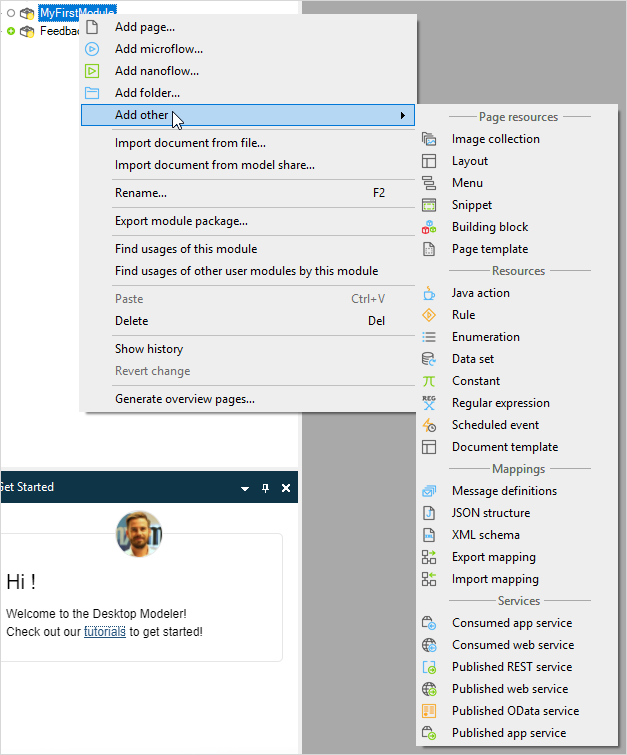

The Mendix Desktop Modeler is the tool for creating, viewing, and editing your Mendix applications. The reference pages listed below describe the various features of the Mendix Desktop Modeler, including document templates, the domain model, microflows, modules, pages, and security.

You can see an overview of the Desktop Modeler in [Desktop Modeler Overview](desktop-modeler-overview)

## Module Documents

Your Mendix app is called a **project** in the Modeler. A project consists of many different sorts of items such as pages and microflows. These are generically referred to as **documents** and are stored in modules and folders.

Right-click a module, or folder, within the **Project Explorer** to add documents.

The following reference documents describe the documents you can add:

* [Pages](pages)
* [Microflows](microflows)
* [Nanoflows](nanoflows)
* [Images](images)
* [Layouts](layout)
* [Menus](menu)
* [Snippets](snippet)
* [Building blocks](building-block)
* [Page templates](page-templates)
* [Java Actions](java-actions)
* [Rules](rules)
* [Enumerations](enumerations)
* [Data Sets](data-sets)
* [Constants](constants)
* [Regular Expressions](regular-expressions)
* [Scheduled Events](scheduled-events)
* [Document Templates](document-templates)
* [Message Definitions](message-definitions)
* [JSON structures](json-structures)
* [XML schemas](xml-schemas)
* [Export mappings](export-mappings)
* [Import mappings](import-mappings)
* [Consumed app services](consumed-app-services)
* [Consumed web services](consumed-web-services)
* [Published REST services](published-rest-services)
* [Published web services](published-web-services)
* [Published OData services](published-odata-services)
* [Published app services](published-app-services)

## Additional Information About the Desktop Modeler

The following reference documents provide additional information about using the Desktop Modeler

* [Data Types](data-types)
* [Dialog Boxes](dialogs)
* [Domain Model](domain-model)
* [Integration](integration)
* [Modules](modules)
* [Projects](project)
* [Security](security)
* [Translatable Texts](translatable-texts)
* [XML](xml-reference-guide)
* [XPath](xpath)
