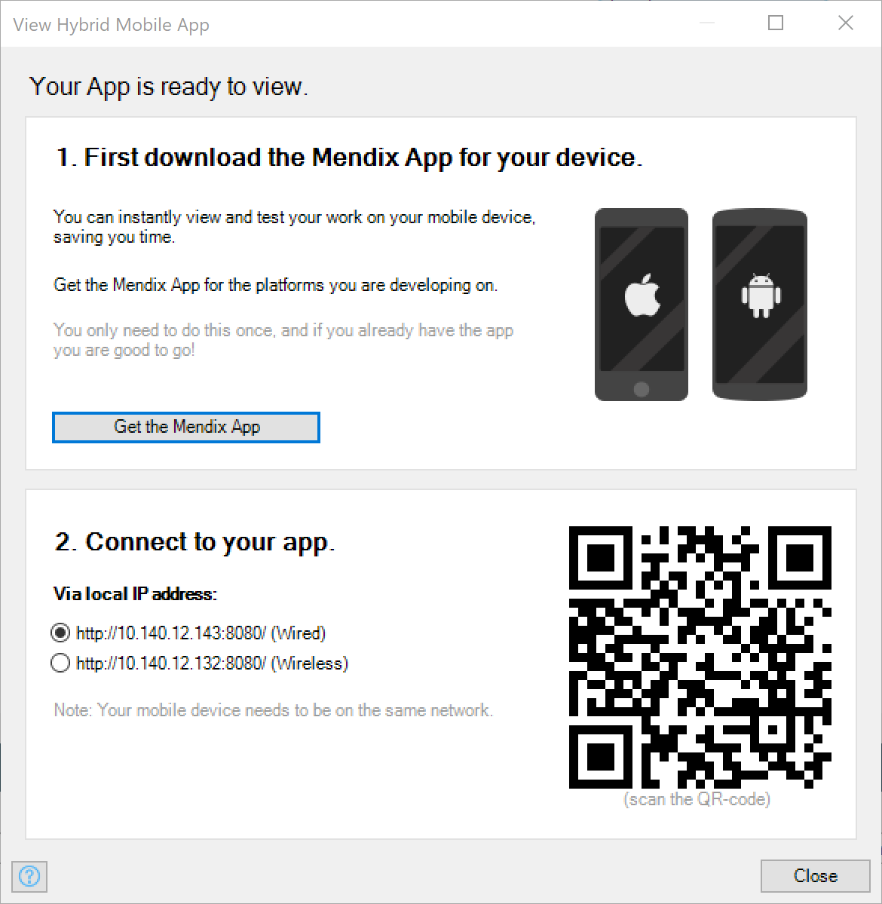

## 1 Introduction

Hybrid Mendix apps can simply be viewed in mobile web browsers. However, mobile device features cannot be accessed through HTML and JavaScript. Also, if you want to publish your hybrid app on the Apple App Store, Google Play, or Microsoft Phone Store, you have to wrap your app in a native shell. We use [local builds](/developerportal/deploy/mobileapp#publish) to accomplish this.

These apps are called "hybrid" apps because they are a hybrid of a web and a native app. Mendix facilitates the creation of hybrid mobile apps in a number of ways.

## 2 The Mendix Mobile App

While developing a hybrid mobile app, you can quickly preview it in in the browser by using the **View Hybrid Phone App Online** or **View Hybrid Tablet App Online** from the toolbar or through the **Run** menu.

However, when you use native widgets on your hybrid pages, some of these widgets might not work in the browser. Some of these widgets will offer an alternative implementation for when they are running in an ordinary browser; others will not work at all. To see what your app will look like inside the wrapper, you can use the Mendix Mobile app. In Studio Pro, you can reach the hybrid mobile app dialog box via **View in the Mendix App** in the toolbar or through the **Run** menu. It shows a QR code that can be scanned with that app. This is a quick way to load your app into a compatible environment.

For more information about how to download the Mendix Mobile app, see [Getting the Mendix Mobile App](getting-the-mendix-app).

{}

Your mobile device has to be on the same network as your development machine for the Mendix Mobile app to work. If this is the case and the connection still fails, make sure that communication between devices is allowed in the Wi-Fi access point.

{}

## 3 Read More

* [Mobile](mobile)
* [Getting the Mendix Mobile App](getting-the-mendix-app)
* [Customizing Hybrid Mobile Apps](customizing-hybrid-mobile-apps)
* [Packaging Hybrid Mobile Apps](packaging-hybrid-mobile-apps)

