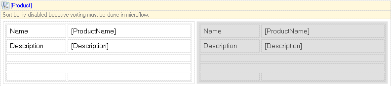
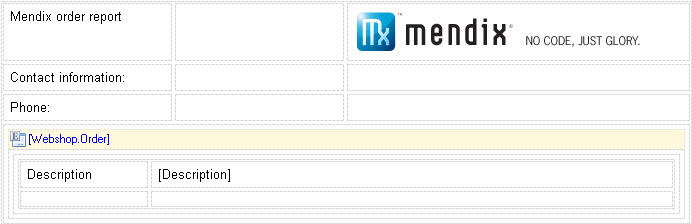
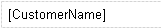
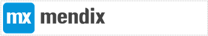

## 1 Introduction

Document Templates are used to model a template required as input for a document export action which can generate all kinds of documents based on application data. They are composed much in the same way as [Pages](pages).

{}
This page describes what document templates are for and what kind of widgets can be placed on them. If you want to see the properties of the document template you can check the documentation for a [Document Template](document-template) itself.
{}

The document templates also contain components, also know as _widgets_. Below is a categorized overview of all widgets. The following categories are used:

* [Core widgets](#core) are central to building document templates in Mendix. These are the widgets that can show a list of entities or a single entity
* [Layout widgets](#layout) are used to structure the layout of your document templates
* [Dynamic data widgets](#dynamic) make it possible to show values of attributes and associations
* [Static data widgets](#static) allow you to work with static data such as a predefined image

Additionally, in most widgets as well as on the document template itself, a _style_ can be defined. This will be discussed in the topic [Style](#style).

If you'd like to show text in a language with uncommon characters such as Arabic or Thai, make sure you select a font in the style editor that supports these characters. 'Tahoma' is such a font.

## 2 Core Widgets {#core}

The core widgets are central to building document templates in Mendix. They can show the contents of a single entity or of a list of entities. Every document template designed to show data from the domain model requires one of these components.

### 2.1 Data Grid

The data grid shows a list of objects in a grid. For example, a data grid can show all the orders a customer has placed.

See [Data Grid (document template)](data-grid).

{}

A data grid showing a list of orders with a description and the referenced customer name.

{}

### 2.2 Data View

The data view is used for showing the contents of exactly one object. If, for example, you want to show details of a single customer you would use a data view to do this. The data view typically contains a table with static labels and dynamic data widgets like a dynamic label. In more complex templates, a data view can contain data grids and other data views for related objects.

See [Data View (document template)](data-view).

{}

A data view showing orderline information.

{}

### 2.3 Template Grid

The template grid shows a list of objects in a tile view. For example, a template grid can show a list of products. The template grid has a lot in common with the data grid. The main difference is that the objects are shown in templates (somewhat like a small data view) instead of rows.

See [Template Grid (document template)](template-grid).

{}

A template grid showing products with name and description.

{}

## 3 Layout Widgets {#layout}

Layout widgets give structure to a form. They do not show data but provide a layout in which you can place other widgets that do.

### 3.1 Table

Tables can be used to change the layout of the form. They contain a number of rows and columns and the intersection of the two is called a cell. Each cell can contain widgets. Cells can be merged horizontally and vertically before they are filled to allow for asymmetric layouts.
Tables can be used both inside and outside data view or templategrid widgets.

See [Table (document template)](table).

{}

A table with four rows and three columns. Last row containing a data view with another table.

{}

### 3.2 Page Break

When inserting a page break, the current page will be cut off after the break and widgets below the break will be displayed in a new page.

See [Page Break (document template)](page-break-document-template).

{}

A page break

{}

### 3.3 Line Break

When inserting a line break, a new line will be inserted at that position.

See [Line break (document template)](line-break-document-template).

## 4 Dynamic Data Widgets {#dyanmic}

Dynamic data widgets are used for showing (dynamic) data. They must be placed inside a data view or template grid because they show attributes or associations of an entity.

### 4.1 Dynamic Label

A dynamic label would be used for the same attributetypes as a text box in form builder. It can be used to display a text value.

See [Dynamic label (document template)](dynamic-label-document-template).

{}

A dynamic label linking to a customer name.

{}

### 4.2 Dynamic Image

A dynamic image can be used to show a System.Image. If the image is not available (for example: the image was never saved) it will show the preset default image. It can be deployed inside a data view or templategrid.

See [Dynamic Image (document template)](dynamic-image-document-template).

{}

A dynamic image inside a table cell, showing the preset default image.

{}

## 5 Static Data Widgets {#static}

These widgets contain static (fixed) data to help create the look of the generated document.

### 5.1 Static Label

A static label shows a line of static text. You can use it to place custom text inside a dataview or template grid or table.

See [Static Label (document template)](static-label-document-template).

{}

A label with text 'Customer name'.

{}

### 5.2 Title

A title works much like a static label but can be placed outside a data view, template grid or table.

See [Title (document template)](title-document-template).

### 5.3 Static Image

A static image shows a predefined image. It can be put either in- or outside a data view or templategrid.

See [Static Image (document template)](static-image-document-template).

{}

A static image inside a table cell.

{}

## 6 Style {#style}

See [Style](style)
