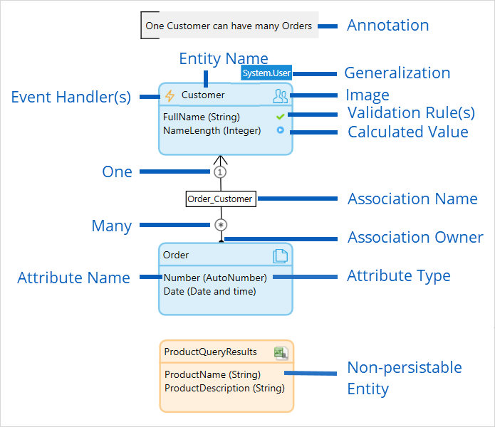

## 1 Introduction

The **domain model** is a model that describes the information (or *data*) used by your application in an abstract way. It is central to the architecture of your application. Each [module](modules) has its own domain model which describes the data used in that module. All modules within a app project can use data from all the domain models within the app.

A domain model consists of [entities](entities) with their relationships to other entities represented by [associations](associations). You can also add [annotations](annotations) to your domain model to explain how it is to be used.

Below is a domain model that defines customers and orders. The names of the entities are `Customer` and `Order`. The line between them is an association. `Order_Customer`. One customer can have many orders, but each order is for one customer. Within the boxes representing the entities you can see the [attributes](attributes) of the entities together with the [type](attributes#type) of data they hold. There is also a [non-persistable](persistability) entity, `ProductQueryResults`, which is used to record product information which is retrieved from a separate product system.

| Element | Displays |
| --- | --- |
| Annotation | A comment explaining an aspect of the domain model |
| Entity Name | How the entity will be referred to in the database |
| Event Handler(s) | An indication that one or more [event handlers](event-handlers) have been set up for this entity |
| Image | An image which helps to identify the entity |
| Validation Rule(s) | An indication that one or more [validation rules](validation-rules) have been set up for this attribute |
| Calculated Value | And indication that the value of this attribute is calculated |
| One | Indicates that one of this entity relates to the quantity of the entity at the other end of the association |
| Association Name | How the association will be referred in the database |
| Many | Indicates that many of these entities relate to the quantity of the entity at the other end of the association |
| Association Owner | An end of an association without an arrow indicates that this entity owns the association (it is possible for both entities to own the association) |
| Attribute Name | How this attribute will be referred to in the database |
| Attribute Type | The [type](attributes#type) of data stored in this attribute |
| Non-persistable Entity | This is an entity which is not stored in a database but only stored temporarily within the app |

## 2 Implementation

In the database every entity is stored in a separate table and has columns for the attributes defined in Studio Pro, the system attributes, and a unique object identifier. If an entity has specializations there is also a column indicating which specialization the object belongs to. An association is stored in a junction table with the identifiers (ID) of both objects.

Take a look at the following domain model.

The entity 'Customer' is stored in the table 'module$customer' which is shown below. Take note of the 'system$owner' and 'system$changedby' columns which contain the IDs of the 'User' objects from the 'System' module.

| id | createddate | changeddate | system$owner | system$changedby | fullname |
| --- | --- | --- | --- | --- | --- |
| 1 | 2006-10-24 08:10:45.053 | 2009-11-27 09:56:45.099 | 66 | 29 | Steve Jobs |
| 3 | 2007-09-30 09:56:45.099 | 2008-04-01 08:10:45.053 | 66 | 34 | Bill Gates |

The association 'Order_Customer' is stored in the table 'module$order_customer' which is shown below. Both columns contain IDs of the associated objects.

| module$orderid | module$customerid |
| --- | --- |
| 8 | 1 |
| 5 | 3 |

The entity 'Order' is stored in the table 'module$order' which is shown below. It is similar to the table of the entity 'Customer'. However all system attributes have been disabled and are not stored in the table.

| id | number | date |
| --- | --- | --- |
| 5 | 5 | 2009-11-27 09:56:45.099 |
| 8 | 8 | 2008-04-01 08:10:45.053 |
