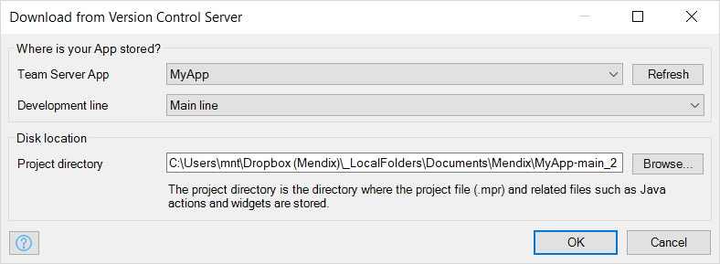
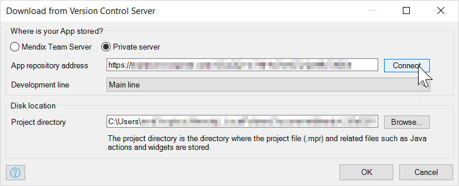

## 1 Introduction

Use the **Download from Version Control Server…** menu item to download an app from an SVN version control server (for example, [Team Server](/developerportal/develop/team-server)). If you are currently editing an app, the project will be closed (after prompting to save any changes) and the newly downloaded app will be opened using the current version of Studio Pro.

{}
If the downloaded app was created with a different version of Mendix, you will be asked if it can be converted to the current version.

You can also use the [Open App Dialog](open-app-dialog) to download and open an app from Team Server. However, you will need to use this option if you want to download a second copy of an app (and development line) you already have on disk.
{}

## 2 Where is Your App Stored?

If **Enable private version control** is set in the project [Preferences](preferences-dialog#enable), you can choose between the **Mendix Team Server** or a **Private server**. If it is not enabled, you will only be able to choose an app from the Mendix Team Server.

### 2.1 Mendix Team Server

Use the **Team Server App** dropdown to choose the app you want to download.

For more information about the Mendix Team Server, see [Team Server Overview](/developerportal/develop/team-server).

### 2.2 Private Server

Enter the URL of your private SVN server in **App repository address** and click **Connect**.

## 3 Development Line

Choose the **Development line** you want to download.

For more information about development lines, see [Version Control](version-control).

## 4 Project Directory

Choose the **Project directory** you want to download the app to. The suggested name includes the name of the development line (*main* or the name of the branch line), but you can change this if you want.
