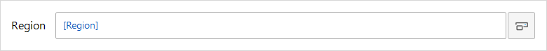
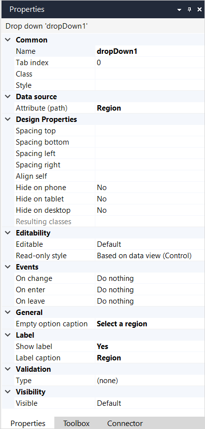
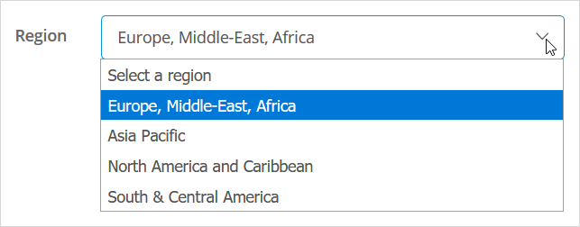

## 1 Introduction

A **drop down** is used to display and, optionally, allow the end-user to edit the value of an attribute of [data type](data-types) *enumeration*.

A drop down must be placed in a [data widget](data-widgets) and displays an attribute of the object(s) retrieved by that widget. The name of the attribute to be displayed is shown inside the drop down, between square brackets, and colored blue.

{}
A drop down should not be confused with a [reference selector](reference-selector), which is used to select an [association](associations) to another object.
{}

For example, the following drop down allows the end-user to see, and set, the **Region** to which a customer is allocated.

## 2 Properties

An example of drop down properties is represented in the image below:

{}
{}

Text box properties consist of the following sections:

* [Common](#common)
* [Data source](#data-source)
* [Design Properties](#design-properties)
* [Editability](#editability)
* [Events](#events)
* [General](#general)
* [Label](#label)
* [Validation](#validation)
* [Visibility](#visibility)

### 2.1 Common Section{#common}

{}

### 2.2 Data Source Section{#data-source}

{}

### 2.3 Design Properties Section{#design-properties}

### 2.4 Editability Section{#editability}

{}

{}

{}

### 2.5 Events Section{#events}

{}

{}

{}

### 2.6 General Section{#general}

#### 2.6.1 Empty Option Caption

Empty option caption is the text that is shown for the empty option in the drop-down shown to the end-user. This is a translatable text. For more details, see [Translatable Texts](translatable-texts).

Adding a caption for the empty option improves the user experience of your application. It also helps end-users using a screen-reader to operate the application easily.

For example, the drop-down that allows the end-user to select the region allocated to a customer could have a caption `Select a region`.

### 2.7 Label Section{#label}

{}

### 2.8 Validation Section{#validation}

{}

### 2.9 Visibility Section{#visibility}

{}

## Read More

*   [Data View](data-view)
*   [Attributes](attributes)
