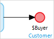

## 1 Introduction

An end event defines where the flow will stop. If the return type of the flow is 
not *Nothing*, a [return value](#return-value) should be specified.

If you want to stop your flow after an activity, you link the activity to a stop event with a sequence flow. In this case, the flow is called from another flow that expects the *Buyer* to be returned.

## 2 Behavior Properties

### 2.1 Return Value {#return-value}

The return value is the value that is returned to the flow that called the current flow. The value can be entered as an [expression](expressions).

## 3 Read More

* [Start Event](start-event)