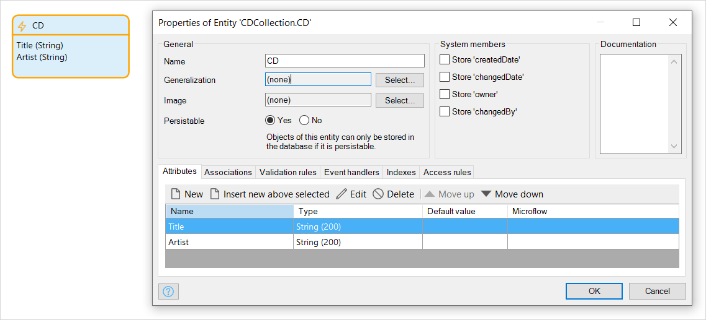

## 1 Introduction

An **entity** usually represents a class of real-world objects, such as customers, invoices, CDs, etc. An instance of an entity is called an object.

For example, the object representing the CD 'Exodus' could be an instance of the entity 'CD'.

 

The properties or features of an entity are described using [attributes](attributes). An attribute represents a small piece of information about an entity, such as the name or birth date of a person.

For example, you have a collection of CDs like the one in the table below:

| Title | Artist |
| --- | --- |
| How to Dismantle an Atomic Bomb | U2 |
| Exodus | Bob Marley & The Wailers |

The rows in the table are CDs. The type of the two rows is 'CD' and this is the entity name. A specific CD like 'How to Dismantle an Atomic Bomb' of the band U2 is called an object of the entity 'CD'. Characteristics like the title and artist are called attributes.

## 2 Properties

An example of the entity properties is represented in the image below:

{}
{}

Entity properties consist of the following sections:

* [Access rules](#access-rules)
* [Documentation](#documentation)
* [General](#entities-general-properties)
* [System members](#system-members)

### 2.1 Access Rules Section {#access-rules}

#### 2.1.1 Access Rules

For more information on access rules, see [Access Rules](access-rules).

### 2.2 Documentation Section {#documentation}

#### 2.2.1 Documentation

This allows you to describe aspects of the entity which may be useful to you or other team members when using the entity within the app.

### 2.3 General Section {#entities-general-properties}

#### 2.3.1 Name

The name property defines the name of the entity. This name is used to refer to the entity in forms, microflows, queries, constraints, etc.

The name only has to be unique within a module domain model. You can have two entities with the same name, provided they are in the domain models of different modules.

#### 2.3.2 Generalization {#generalization}

An entity can be a more specialized version of a general entity. This means that the specialized entity has all the attributes, associations, events, and other properties of the more general entity. Using the generalization property you can specify which entity is the generalization of the entity. For example, the `Car` entity could have `Vehicle` as its generalization.

The generalization specifies the entity from which a specific entity derives its properties (attributes, associations, events, and other properties). It is used when entities have common attributes and can be generalized using a super entity. In object oriented programming (OOP) the generic term for generalization and specialization is called **inheritance**.

One important use of this feature is to derive functionality from the System module, for example, images from the entity 'Image' and files from the entity 'FileDocument'. 

For example, this property can be used in a situation where, you have an entity 'Student' and an entity 'Professor' which have some generic properties. They both have a name, telephone number and email address and can be a member of one or more courses. Both entities are *generalized* in the entity 'Member'. Conversely, this means that the entity 'Member' is *specialized* in the entities 'Student' and 'Professor'.

For more information, and a discussion on the relative merits of using generalization or associations, see [Generalization & Associations](generalization-and-association).

#### 2.3.3 Image

The image property can be used to associate the entity with an image. In the domain model this image is visualized in the right-top corner of the entity representation. The image is also visible in entity selection windows and in the Connector. For instance, when selecting an entity for a data view.

#### 2.3.4 Persistable

Define whether instances of this entity can be stored in the database. For more information, see [Persistability](persistability).

### 2.4 System Members Properties

#### 2.4.1 Store 'createdDate'

This property defines whether the entity contains the system attribute 'createdDate'. This is an attribute of type **Date and time** that stores the date and time when the object was created. The value of this attribute is automatically set by the server upon creating an object.

| Option | Description |
| --- | --- |
| True | Entity contains the system attribute 'createdDate'. |
| False  *(default)* | Entity does not contain the system attribute 'createdDate'. |

#### 2.4.2 Store 'changedDate'

This property defines whether the entity contains the system attribute 'changedDate'. This is an attribute of type **Date and time** that stores the most recent date and time when the object was changed.

| Option | Description |
| --- | --- |
| True | Entity contains the system attribute 'changedDate'. |
| False  *(default)* | Entity does not contain the system attribute 'changedDate'. |

{}
The 'changedDate' property is only updated on real changes. Simply changing and committing an entity with the same attribute values does not update 'changedDate'.
{}

#### 2.4.3 Store 'owner'

This property defines whether the entity has the system association 'owner'. This is an association to the system entity 'User' that (initially) stores a reference to the user that created the object. This association is automatically set by the server upon creating an object.

| Option | Description |
| --- | --- |
| True | Entity has the system association 'owner'. |
| False  *(default)* | Entity does not have the system association 'owner'. |

#### 2.4.4 Store 'changedBy'

This property defines whether the entity has the system association 'changedBy'. This is an association to the system entity 'User' that stores a reference to the user that most recently changed the object.

| Option | Description |
| --- | --- |
| True | Entity has the system association 'changedBy'. |
| False *(default)*  | Entity does not have the system association 'changedBy'. |

## 3 Tabs in the Entity Dialog Box

You can also edit an entity by opening the entity properties dialog box.

In addition to the properties described above, there are also tabs which allow you to edit the following:

*   [Attributes](attributes)
*   [Associations](associations)
*   [Validation Rules](validation-rules)
*   [Event Handlers](event-handlers)
*   [Indexes](indexes)
*   [Access Rules](access-rules)

See the detailed pages for each of these tabs for more information.
