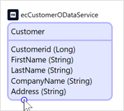
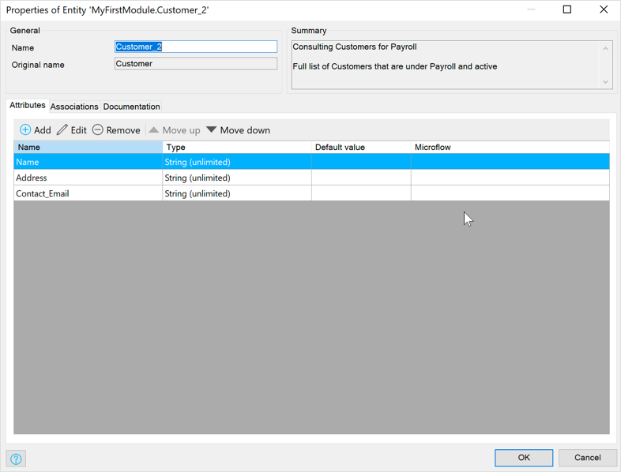

{}[first draft after split from combined doc - therefore further editing/additiona required. Also for 8.14]{}

## 1 Introduction

External entities connect to external datasets that are made available through [Mendix Data Hub](/data-hub/index). These entities are displayed as *purple* entity containers in the domain model. 

{}

Mendix Data Hub is a premium product and only accessible to users that have a license.

{}

External entities are added to the domain model through the [Data Hub pane](data-hub-pane). They connect to the shared datasets which can be utilized or *consumed* in your module. 

{}

For more information on adding external entites from the **Data Hub** pane see [Adding External Entities](#adding-external-entities).

## 2 Adding an External Entity to a Project {#adding-external-entities}

To add an external entity to your project, do the following:

1.  Go to the domain model.
2.  In the **Data Hub** pane, search for an entity that you would like to use in your app project.

  {}In the Data Hub Catalog, an OData service may be registered several times with different versions or deployed to different environments all exposing the entity that you may want to use. Search the Data Hub Catalog first and find the one most relevant to the requirements for your project.{}

3.  Drag and drop the entity in the domain model. The entity and its attributes are then added to your app project:

	

{}
If you drag an entity that is associated with an entity already in your domain model from the same service, the association will be made between the entities. For more information on associations between external entities, see [Associations](#properties).
{}

When an external entity is added to the domain model, two documents will be added in the **Project Explorer**: the **Consumed OData Service** document containing the metadata for the consumed entity, and the **OData Location** of the dataset. For more information, see [Consumed OData Service](consumed-odata-service). 

In the **Project Section** of the **Data hub** pane the consumed entities that are in the current project will be listed. 

{}
If there is a newer version of a consumed service available in the Data Hub Catlog, this will be indicated in the **Data Hub** pane by ??? against the service name.  the For more information, see the [Updating a Consumed OData Service](consumed-odata-service#updating) section in *Consumed OData Service*.
{}

It is possible to make local changes to the properties of external entities that only affect how the data is used and presented in the consuming app. All other properties are defined in the source application and cannot be changed. When multiple external entities from the same OData service are used in a module or app project, associations between the entities (made in the source app) will automatically be made in the local module.

For more information on using published OData services and entities through the Data Hub Catalog, see [How to Consume Registered Assets](/data-hub/data-hub-catalog/consume) in the *Data Hub Guide*.

{}[further x-refs to consumed OData services?]{}

## 2 Properties of External Entities {#properties}

Compared to local entities, external entities have a limited number of properties that can be changed. The rest of the properties are defined in the originating app and are, therefore, read-only. 

{}
Changes that are made to the properties of external entities are made only in the consuming app. The originating app will not be affected by the changes.
{}

### 2.1 General

This tab displays the general external entity properties and provides the possiblity of making changes that will be applied locally. These values are defined in the originating app will be displayed but are not editable:

* **Name** – the name of the entity in the local app project
* **Original name** – this is read-only and shows the name of the entity as defined in the consumed OData service
* **Summary** – this is a read-only field and displays the description for the entity in the originating app

### 2.2 Attributes {#attributes}

The [attributes](attributes) that have been exposed in the OData service for the external entity are listed here. All changes that are made to the attributes and the attribute list are applied to the local instance of the entity. As they are consumed, these changes will not affect the metadata of the consumed service that the entity is exposed in or the attributes of the entity in the originating app.

The following operations can be done on the displayed attribute list:

* **Add** – add attributes that were exposed in the OData service for the entity and were previously removed for this local instance
* **Edit** – edit the selected attribute from the [Edit Attribute Form](#edit-attribute). 

  {}[ insert screenshot of add Attribute form]{}

* **Remove** – remove an attribute from list 

#### 2.2.1 Edit Attribute {#edit-attribute}

The **Edit Attribute** box can be used for specifying a local name for the attribute and adding a local description.

{}[ insert text and screenshot of add Attribute form]{}. 

* **General**
  * **Name** – a local name for the attribute
  * **Original Name** – this is a read-only value that displays the original name of the attribute as given in the originating app
  * **Summary** – the description for the attribute in the originating app; to enter a local description, add this in the [Documentation tab](#documentation)
  * **Type** – the **Type** and **Length** of the attribute as defined in the originating app 
* **Documentation** – a description for the attribute that is displayed for users of the current app

### 2.3 Associations {#three}

This tab will show associations that the external entity has with other entities exposed in the same service.

{}[edit this text and add screenshots.]{}

You can **Add** and **Edit** associations to the external entity with a local entity. However, the association cannot be made *from* an external entity to a local entity: the local entity must be the owner of the association.

If you use an external entity in your app project and this entity is associated with other external entities from the same OData service in your app project, the association will automatically be added in the domain model and be listed here. 

{}
It is possible to **Remove** an association between two external entities in the domain model that has been automatically added. If at a later stage you want to restore the association, you can do this in the domain model by right-clicking one of the external entities and clicking **Add** > **Association**.
{}

{}
If you want to connect two external entities that are not connected in the originating app, this is not possible as the relationship to the data cannot be influenced locally. However, consider adding a local entity and connect this local entity with both external entities. The local entity must be the owner of both associations, in this case.
{}

### 2.3.1 Association Properties

{}[add preamble and add 8.14 screenshots.]{}

**Name** – name of the association
**Type** – read-only for associations between two external entities
**Owner** – read-only for associations between two external entities

{}
An external entity cannot be the owner for an association between an external and a local entity.
{}

{}[add preamble and add 8.14 screenshots.]{}

When you **Edit** an association, the following properties are available:

* **Name** – name of the association in the originating app
* **Original Name** – name of the association given to it in the originating app 
* **Summary** – read-only description of the association from the originating app
* **Multiplicity** – read-only multiplicity values from the originating app
* **Documentation** – go to this tab to add a local description for the external entity association

### 2.4 Documentation {#documentation}

You can add any local information about the external entity in this tab.

## 3 External Entity Limitations

{}[not too happy with this. Consider moving the SP-specific limitations on external entities to here. Refine.]{}

External entities are the endpoints that are defined in the published OData service from the originating app. The consumed OData service document displays the values from the service metadata when the external entity is used through the **Data Hub** pane. The limitation on external entities is that they are consume-only entities. The datasets associated with the entities are maintained in the originating apps.

For more details on consuming services and exposed entities, including operations that can be performed on external entities, see [How to Consume Registered Assets](/data-hub/data-hub-catalog/consume) in the *Data Hub Guide*.
