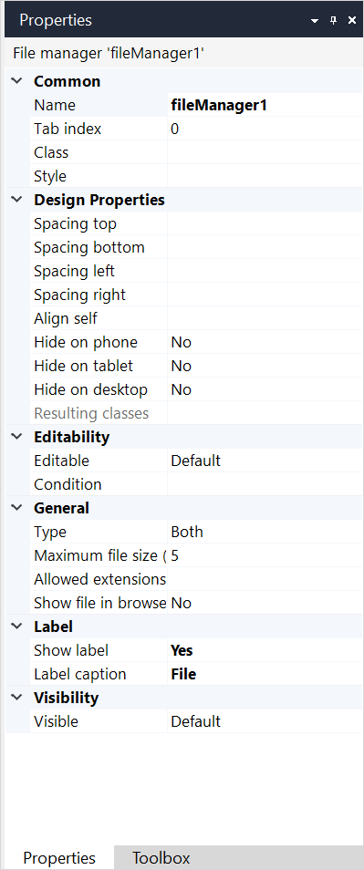

{}The file manager widget is not supported on native mobile pages.{}

## 1 Introduction

A file manager is used to upload and/or download files.

It must be placed inside a data view connected to the entity System.FileDocument or a specialization thereof.

## 2 Properties

An example of file manager properties is represented in the image below:

{}
{}

File manager properties consist of the following sections:

* [Common](#common) 

* Design Properties

* [Editability](#editability)

* [General](#general)

* [Label](#label)

* [Visibility](#visibility)

### 2.1 Common Section {#common}

{}

### 2.2 Editability Section {#editability}

{}

### 2.3 General Section {#general}

#### 2.3.1 Type

The **Type** property indicates how the end-user will be able to use the file manager.

| Value | Description |
| --- | --- |
| Upload | The file manager can only be used to upload a file. |
| Download | The file manager can only be used to download a file. |
| Both *(default)*  | The file manager can be used to both upload and download a file. |

#### 2.3.2 Max File Size (MB)

**Max file size (MB)** determines the maximum size of files (in megabytes) that can be uploaded.

Default: *5*

#### 2.3.3 Allowed Extensions

You can specify file extensions that users are allowed to upload. If no extension is specified, all file extensions are allowed. Separate multiple extensions by a semi-colon, e.g. `txt;doc`

If a file with an extension that is not allowed is selected, a [system text](system-texts) for **File manager/image viewer** > **Error: incorrect file extension** will be shown below the file manager.

#### 2.3.4 Show File in Browser

**Show file in browser** indicates whether a file will be shown in the browser instead of being downloaded.

Default: *False*

### 2.4 Label Section {#label}

{}

### 2.5 Visibility Section {#visibility}

{}

## 3 Read More

* [Page](page)
* [File Widgets](file-widgets)
* [Properties Common in the Page Editor](common-widget-properties)
* [System Texts](system-texts)
