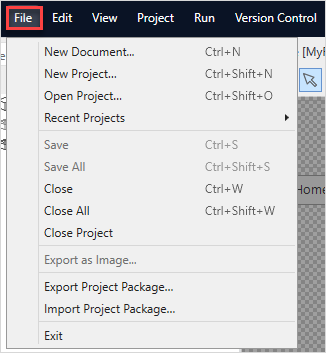

## 1 Introduction

The **File** menu allows you to manage documents and projects, for example, to create a new project or save changes:

{}
{}

## 2 Menu Items Overview

The **File** menu items are described in the table below:

| Menu Item                  | Description                                                  | Shortcut Key                                      |
| -------------------------- | ------------------------------------------------------------ | ------------------------------------------------- |
| **New Document**           | Creates a new document within the project that is currently open. You can choose the name, location and type of the document. | <kbd>Ctrl</kbd> + <kbd>N</kbd>                    |
| **New Project**            | Creates a new single-developer project. A single-developer project is simply a file (with the extension *.mpr* , which stands for "Mendix project") that is stored in the local file system. For more information on the **New Project** menu item and its settings, see [New Project](new-project). | <kbd>Ctrl</kbd> + <kbd>Shift</kbd> + <kbd>N</kbd> |
| **Open Project**           | Opens an existing single-developer project (*.mpr*) or a project package (*.mpk*). See **New Project** above for information on single-developer projects. For more information on the **Open Project** menu item, see [Open Project](open-app-dialog). | <kbd>Ctrl</kbd> + <kbd>Shift</kbd> + <kbd>O</kbd> |
| **Recent Projects**        | Shows a list of recently opened projects for quick opening.  |                                                   |
| **Save**                   | Saves the changes in the currently active document tab.      | <kbd>Ctrl</kbd> + <kbd>S</kbd>                    |
| **Save All**               | Saves the changes in all documents that are open.            | <kbd>Ctrl</kbd> + <kbd>Shift</kbd> + <kbd>S</kbd> |
| **Close**                  | Closes the current document. You will be asked to save or discard changes when needed. | <kbd>Ctrl</kbd> + <kbd>W</kbd>                    |
| **Close All**              | Closes all document tabs. You will be asked to save or discard changes when needed. | <kbd>Ctrl</kbd> + <kbd>Shift</kbd> + <kbd>W</kbd> |
| **Close Project**          | Closes the currently open project and return to the start page. |                                                   |
| **Export as Image**        | Exports the current document as an image in the *.png* format. The following document types can be exported as images: microflows, domain models, document templates, and XML mappings. |                                                   |
| **Export Project Package** | Exports the current app to a project package (*.mpk*) file. This is useful for example when you want to give someone the entire app, or when you need to provide a test app when submitting a ticket. For more information on how to export a project package, see [Export Project Package](export-project-package-dialog). |                                                   |
| **Import Project Package** | Imports a project package that was created with the **Export Project Package** menu item. For more information on importing a project package, see [Import Project Package](import-project-package-dialog). |                                                   |
| **Exit**                   | Closes Studio Pro                                            |                                                   |

## 3 Read More

* [Studio Pro Overview](studio-pro-overview)
