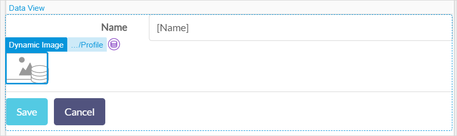

## 1 Introduction

Images, videos & files allow end-users to upload, download, and display files, images, and videos. 

* [File manager](file-manager) – allows end-users to upload and/or download files:

    

* [Image uploader](image-uploader) – allows end-users to upload images to the server:

    

* [Image viewer](image-viewer) – displays an image or its thumbnail:

    

## 2 Performing Basic Functions

{}

## 3 Read More

* [Page](page)
* [Pages](pages)