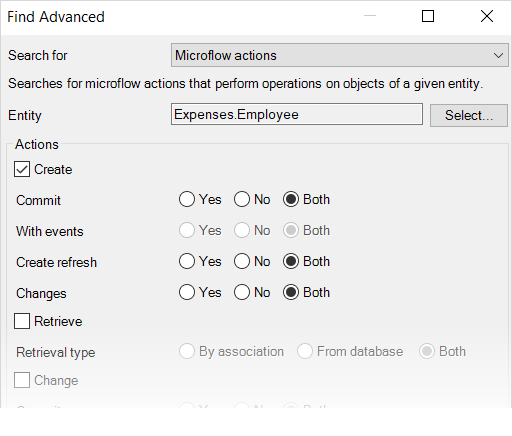
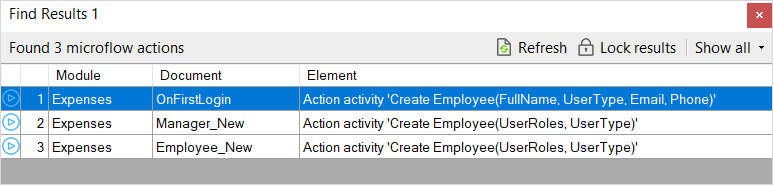

## 1 Introduction

You can search for changes or usages of different elements, documents, Xpaths, changes to various elements, etc. in your application.  

## 2 Finding Object Activities

For example, you can search for microflows that have object activities in them. Do the following:

1. In the top toolbar of , click **Edit** > **Find** **Advanced** or press <kbd>Ctrl</kbd>+<kbd>Shift</kbd>+<kbd>F</kbd>.
    The **Find Advanced** box will open:
    
3.  In the **Search for** option, select **Microflow actions**:
    
4.  Select the entity for which you want to search for object activities, and click **Find**.
    

You can see search results in the **Find Results** pane:

## 3 Read More

* [Edit Menu](edit-menu)