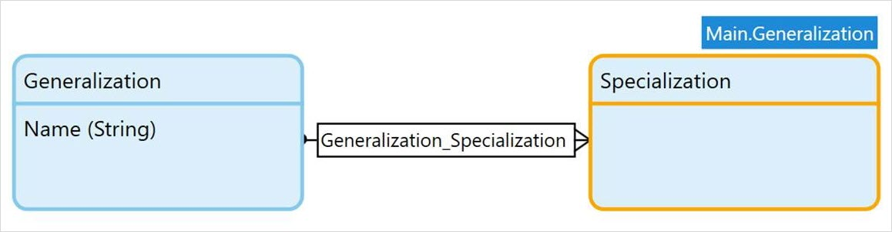

## 1 Introduction

Mendix developers have to choose on a daily basis whether or not they want to use inheritance. It starts the moment you initiate a new project; how do you want to setup your users? Are you going to keep using the already available Account entity in the Administration module? Or are you going to work with separate entities with a one-to-one association to the user account? Or are you going to add (multiple) entities that inherit from **System.User**?

When defining closely related structures, it can be difficult to decide on the best architecture. Should the entity inherit from my structure or do I rather want a one-to-one association? You should consider both options. Both options can have a huge impact on the performance of the application or the speed of development.

## 2 Generalization, Specialization & Inheritance

The Mendix domain model is based on the [UML](http://en.wikipedia.org/wiki/Unified_Modeling_Language) [class diagram](http://en.wikipedia.org/wiki/Class_diagram), which allows us to specify the objects/entities, their attributes and associations. The concept of generalization in UML is exactly the same in Mendix, however, the Mendix domain model uses a different notation to display the generalization. The UML class diagram uses associations with a hollow triangle (arrow) pointing to the super class. In Mendix generalization is expressed with a blue label above the entity, specifying the entity name.

UML also allows us to specify the types of associations, such as an [Aggregation](http://en.wikipedia.org/wiki/Aggregation_(object-oriented_programming)) or [Composition](http://en.wikipedia.org/wiki/Object_composition). The definition of these associations specify whether or not the objects can exist without each other. Unlike UML we can not specify how strong a relationship is. Any dependencies between the two objects have to be specified using [event microflows](/refguide/event-handlers) or [delete behavior/prevention](/refguide/associations).

### 2.1 Performance

In order to understand the impact and behavior of the application, you need to understand the basic concepts of [Transactions](http://en.wikipedia.org/wiki/Database_transaction) and [(Database) Isolation Levels](http://en.wikipedia.org/wiki/Isolation_(database_systems)#Read_committed). The Mendix Platform uses Transactions, which means that every microflow, commit, and delete will happen in a (database) transaction. The transaction is initialized as soon as the microflow executes its first write to the database. Retrieve activities will never start a transaction.

The Mendix Platform uses the transaction level [Read Committed](http://en.wikipedia.org/wiki/Isolation_(database_systems)#Read_committed), which means, as the name suggests, that only committed objects are visible outside the transaction. Any other microflows trying to access an object that is being changed at the same time, will have to wait until the transaction has completed. This is important to know, since this has significant impact on your choice between inheritance or associated objects.

### 2.2 Creating & Changing Objects

When changing an object, the Mendix Platform will write those changes to the database as soon as you execute the commit activity. The update or insert query will be performed based on the values you have changed. This behavior varies per database, but most likely this will lock the record and prevent other users from reading it until the transaction has been completed (either finished or rolled back).

#### 2.2.1 Inheritance

When you change an object with inheritance the platform will potentially prevent all the retrieves on all entities from the hierarchy, since it will look at the super class, which is required for all retrieves.

#### 2.2.2 One-to-One Association

When changing an object, none of the associated objects will be changed. There are two exceptions to this rule: of course if you change the associated object in an object event, or because associated objects are being 'autocommitted', see [Object Activities](object-activities).

Whenever you have a high number of write transactions in your application, it is far better to choose for a one-to-one association, since this limits the number of tables that are being changed/locked during a transaction. However, if you do more inserts than updates it might be worth using inheritance again. Inheritance uses one less table to store the relationship, it does not have the association table. Therefore, any inserts require one indexed table fewer to be updated.

### 2.3 Retrieving Objects

Mendix is optimized to only retrieve the data that is required for the action that is being executed. That means, for example: if you do not show any associated or inherited attributes, those objects will not be included in the retrieve queries.

#### 2.3.1 Inheritance

If you retrieve any specializations from the super class the platform will always include the entire hierarchy in the query, in order to guarantee a consistent data structure. For example, if you have an overview of **Administration.Account**, the platform will include the System.User table whether or not you show any System.User attributes, just to make sure that the data is consistent and complete. Both tables have a clustered index on the object id, so joining the information in the database is extremely efficient.

#### 2.3.2 One-to-One Association

The associated objects will only be retrieved when they are shown in a page. This is less efficient than with inheritance, because the information is retrieved using the association table, but based on how the information is ordered and filtered, it will be far less efficient to join over the association table than over the clustered index that is used with inheritance.

If you require a lot of searching, sorting and displaying of the inherited/associated information it can be significantly more efficient to use inheritance. If the associated information is only required on a few pages, the additional delay retrieving the information over association instead of inheritance might be acceptable compared to the faster retrieve times on any other place in the application.

#### 2.3.3 One-to-Many Association

When using an inheritance with a one-to-many association, you cannot retrieve [by association](retrieve#source).

Here is an example inheritance:



In this example, a list of **Specializations** cannot be retrieved when using a standard by-association retrieve in a microflow if the input is the specialization.

However, there is a workaround for this limitation: The list of Specializations can be retrieved with a Java action using the Java API. This Java action needs two parameters: the **Specialization** and a Boolean **Reverse** via this code snippet:

```
public class RetrieveAsAssociatedWithB extends CustomJavaAction<java.util.List<IMendixObject>>
{
	private IMendixObject __B;
	private main.proxies.Specialization B;
	private java.lang.Boolean Reverse;

	public RetrieveAsAssociatedWithB(IContext context, IMendixObject B, java.lang.Boolean Reverse)
	{
		super(context);
		this.__B = B;
		this.Reverse = Reverse;
	}

	@java.lang.Override
	public java.util.List<IMendixObject> executeAction() throws Exception
	{
		this.B = __B == null ? null : main.proxies.Specialization.initialize(getContext(), __B);
 
		// BEGIN USER CODE
		return Core.retrieveByPath(getContext(), __B, "Main.Generalization_Specialization", Reverse);
		// END USER CODE
	}
}
```
When setting the `Reverse` Boolean to true and using the `Specialization` object as the input, the returned list will contain all the Specializations associated to the Specialization.

## 3 Flexibility

Making a decision between inheritance and associations is something you should do before loading a lot of data into the application. When adding associations, additional data may be required to specify the relationships between objects. When you remove generalizations, the relationship between the two objects will get lost. There are tricks you can use to resolve any previous relationships, however, this can be extremely difficult and time consuming once there is a lot of data available in your application.

### 3.1 Inheritance

Using inheritance can make your microflows easier to maintain, you can re-use functionality but you also lose flexibility. Once you have applied inheritance to an entity it is difficulty to remove the inheritance and keep all the data with a relationship. Or if a record can change type of subclass, for example an employee object changes and becomes a project manager object. In most scenarios there is no perfect solution and there are always concessions to make, just be aware of the implications when making a choice.

Don't just add inheritance because it is easier, or remove it because it is slower. Especially in scenarios were different object types have to go through a similar process it can be worth it to apply inheritance just so you can re-use functionality and increase the consistency and stability of your application. One place you definitely don't want to use inheritance is in a system with a high transaction volume. Writing and updating records in tables with inheritance is slower than just updating a single table. If there are many new or changed objects loaded through, Excel, web services, or any other integration inheritance can slow the process down significantly.

### 3.2 One-to-One Association

When loading data through an integration, inheritance can improve the development speed, because functionality can be re-used. This is a huge advantage since all future changes only have to be applied in a single place. Inheritance however, could case the slower performance if all the changes can be stored in a separate entity. If it is possible to separate all data in a separate entity, and this information is only used by the application in a limited number of locations, it will be significantly faster to keep a one-to-one entity.

## 4 Conclusion

This explanation might not have given you an explicit answer to the question on when to use inheritance, but that is because there is no right or wrong answer. Both inheritance and one-to-one associations have their advantages and disadvantages. Based on the situation you need to decide what is better for a particular entity. Below is a short summary of all the pros and cons for each situation. Based on these criteria you will need to decide for your entity which solution is worth it.

There are a few situations where a clear answer can be given:

* Never use inheritance for entities with:
  * A high number of transactions on the different sub entities (As a high we consider multiple changes or creates per second)
  * Only a handful common attributes. If you feel that it isn't worth creating associated objects for the information, it isn't worth inheriting either
* Never use one-to-one association for entities:
  * That always require the information from the associated objects, and users intensively search and sort on the associated attributes
