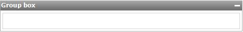

A group box can be used to visually group related widgets together. Group boxes are displayed as a frame around nested widgets with an optional header. Group boxes can be configured to collapse and expand dynamically.

{}

An empty group box.

{}

## Common properties

{}

{}

{}

## General properties

### Show header

Toggle whether a header is shown above the group box.

_Default value:_ True

### Caption

The text of the header. This property is only applicable if the header is visible.

_Default value:_ Group box

### Collapsible

This property specifies whether the group box can be collapsed by clicking the header and if so, whether it starts collapsed or expanded. This property is only applicable if the header is visible.

_Default value:_ Yes (start expanded)

## Visibility properties

{}

{}
