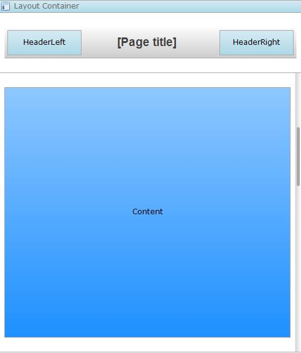
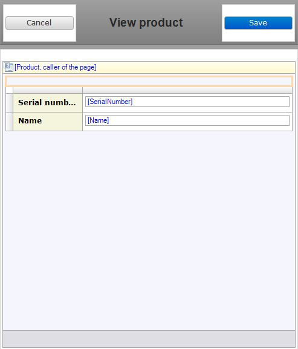

A header combines the functionality of a page title and a control bar for your page. Due to its compact design and versatility it is often used in mobile pages. As a lay-out feature it can only be used in a [lay-out|.

Headers consist of three distinct elements: a left drop-zone, a right drop-zone, and a page title. The drop-zones are intended for confirmation buttons, such as the [Create button](new-button), but can easily be appropriated for any number of alternate implementations. The page title derives its value from the page title setting of the page being displayed.

{}

A basic lay-out utilizing a header to give the page structure.

An edit page derived from the lay-out above. The page title it automatically adjusted to match that of the page and the [placeholders](placeholder) have been used to add a save and cancel button, replacing the need to add a control bar to the data view.

{}
