## 1 Introduction

Have you been wondering how to create your own documents with Mendix? Then this reference will be a good read for you!

With Mendix, you have the possibility of generating documents in different ways. You will learn the fundamentals here for generating a document from your own application.

Before we start, we recommend you first read the following two Mendix Reference Guide pages:

* [Document Templates](document-templates)
* [Generate Documents](generate-document)

## 2 Know Your Document

Before you start with producing a document with Mendix, making a draft version of the document you want to produce is advised. You can sketch something on a piece of paper or have your customer provide you with an example. Either way, it is good to have in mind what you want to achieve.

Based on the desired document, you can determine your strategy for producing such a document. Mendix offers you numerous options with the out-of-the-box document template functionality for producing documents, but it can happen that the Mendix features would not suffice for your document generation. Don’t worry, for alternative ways of producing documents with Mendix, see [5 Alternative Ways of Creating Documents](#Alternative).

For our example, we’ve concluded that the Mendix functionality does suffice. So, let’s have a look at how this works with an example.

## 3 The Business Case

In this application, customers can purchase products. They will do so by creating orders and selecting the products they want to purchase. To be able to present the customer with an overview of their order, a PDF will be created that the customer can download from their confirmation email (where the PDF is added as an attachment). The order should show the information of the customer, the logo of the company, the products with their price, and the sum of the order.

## 4 Generating a Document with Out-of-the-Box Mendix Functionality

### 4.1 The Domain Model

The domain model that belongs to this case looks like this:

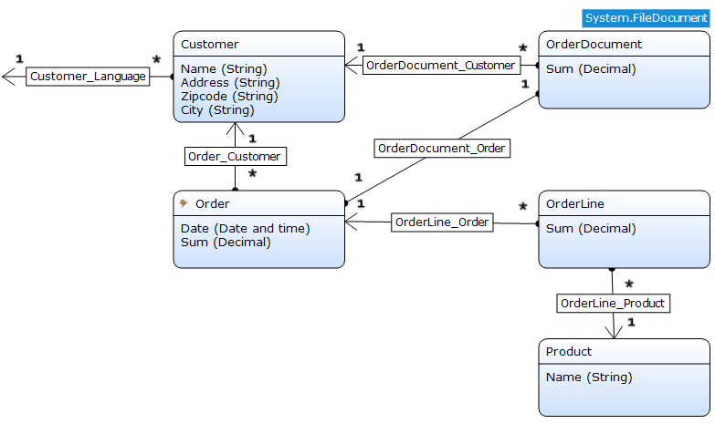

The **Customer** withholds the address information and the language of the communication preference. The **Order** owns the date and sum of all the order lines. The **OrderLine** entity has the customer-specific price for a **Product**. Because you want to generate a document, the **OrderDocument** entity has been added. This entity inherits from the **System.FileDocument** entity.

{}
Do not use the **Sytem.FileDocument** entity directly, because you have no control over the security of that part from the **System** module.
{}

### 4.2 The Microflow

Now the domain model has been set up, you are ready to create the microflow for your new generate document function.

Start with a new folder to organize all the order document creation related sources:

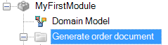

Now you need a microflow with the purpose of handling the creation of the document:

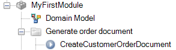

The microflow will be having the default start and endpoint at this moment:

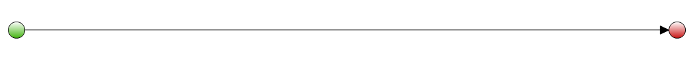

After the microflow creation, think of what information you would like to use in the document. Let’s start with an order as input information. At a later moment, you can see if you need any other data and retrieve that via the order instance.

{}
When you create microflows, it is a best practice to limit the number of input parameters to promote reuse.
{}

Here is the input parameter:

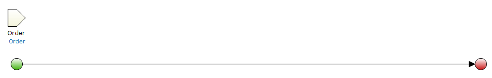

In the next step, you will create a new OrderDocument. This object is needed to store the actual document. Here we will set the reference to the **Order** variable and set the name of the document:

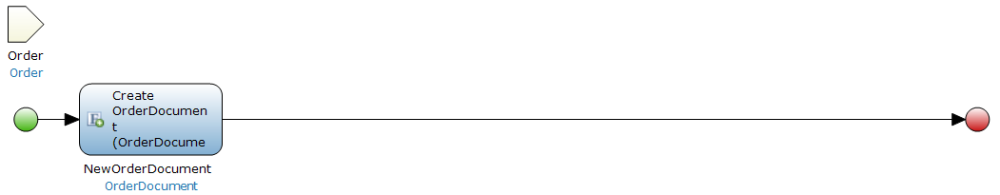

Now you need to have a **Language** object. In our case, the **Customer** has been set up to withhold information about the communication language preference. In our microflow example, you first retrieve the **Customer** via the **Order**, and then retrieve the **Language** from that **Customer**:

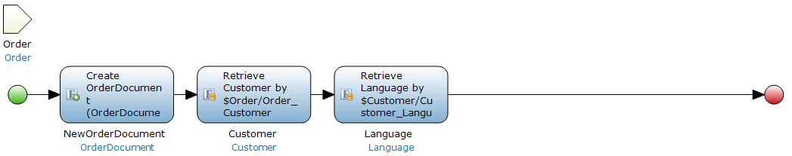

The next step is to use the generate document activity. Within this activity, you can use the available variables and select the document template to create the document. However, the document template does not exist yet, so you need to create it and place it in your folder:

This is the document template configuration:

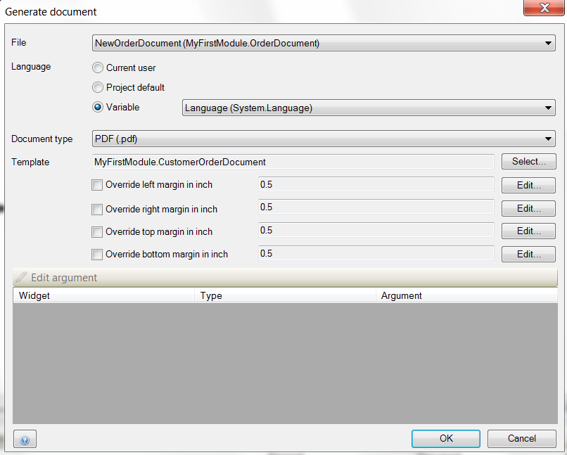

{}
Based on the changes you will make in the selected template, the arguments will change.
{}

The document template activity has been added:

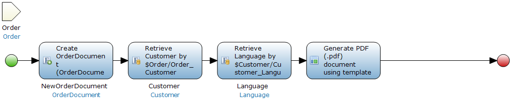

After you have configured the general settings of the document template, you do not need a seperate commit for **NewOrderDocument**. This variable is automatically committed via the document template activity.

Now that you have set up the generate document configuration, you can have a look at configuring the template itself.

{}
Make sure to set the correct entity access for entities and their attributes used in the document template. Read access is a must for those attributes that are shown in the template. Here is a **Customer** entity that is configured to **Read, Write** for the **User** module role:

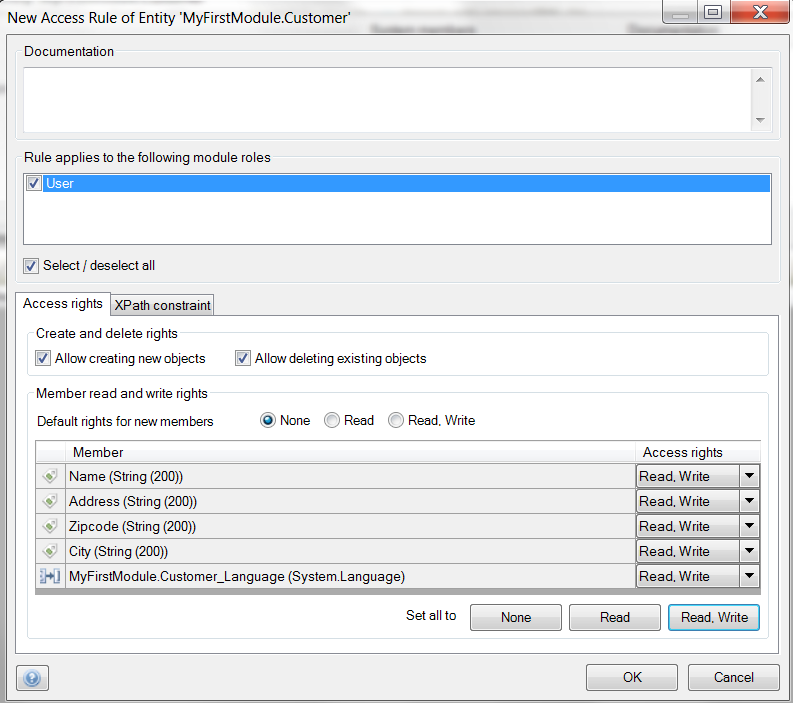

{}

### 4.3 The Document Template

In this example, the following document template is available:

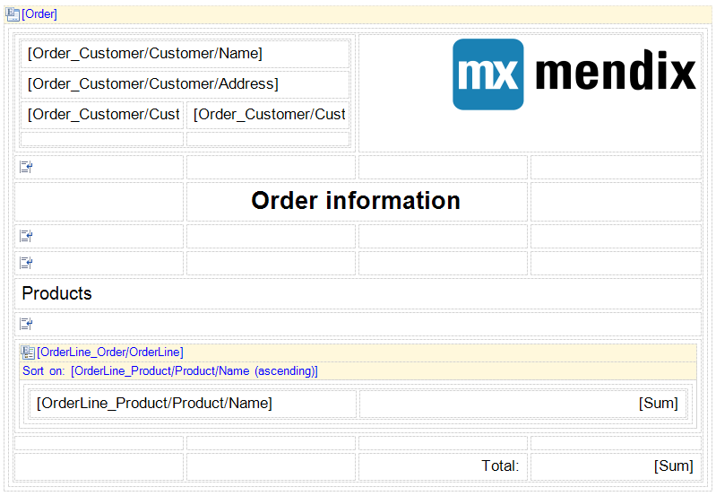

In this document template, you start with a data view that has the information of the order. From this order, you can get the customer information and the information about the purchased products.

The data view will make use of tables, table cells, labels, pictures, line breaks, and a template grid to compose the document.

Now that you have created the document template, you can see that there is an error in the error dock:

To resolve this error, open the **Generate document** activity of the microflow. When opening the activity, the parameter mapping will directly be updated and allocate the variable to the mapping parameter.

Now, your generate document configuration should look like this:

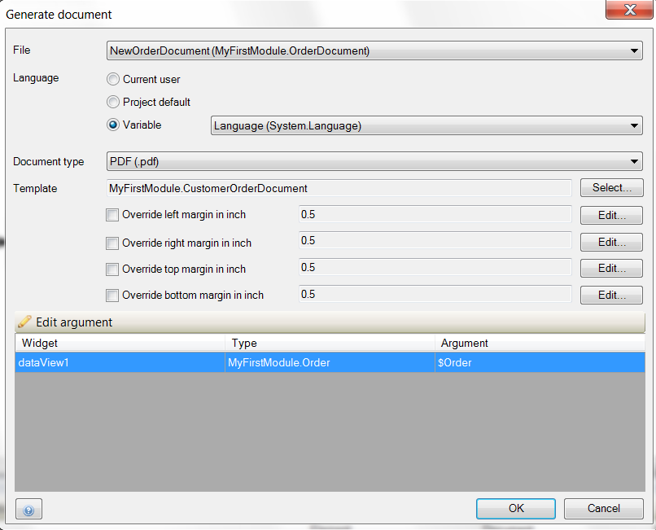

The document template is now configured, and the microflow is ready to be used. If we call this microflow as a sub-microflow, you can add a download activity in the overarching microflow. This microflow could look like this, in which you call the sub-microflow, retrieve the created document, and download the file:

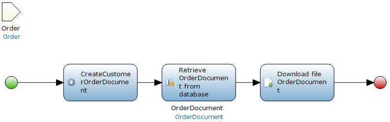

This is the result of the document template:

In this example, you retrieved the **OrderLine** information via the **Entity (path)** data source. An alternative way of doing this is to use a microflow that returns objects for the list presentation. If you do this, make sure to add the correct user role(s) to the microflows that are being used as data source microflows within the document template.

## 5 Alternative Ways of Creating Documents

In addition to out-of-the-box Mendix functions, there are two other ways of generating documents with your Mendix app.

### 5.1 App Store Module

In the Mendix App Store, [Document generation 4 Mendix](https://appstore.home.mendix.com/link/app/2026/) is available.

For more information on this way of working, see [Document Generation for Mendix, Finally](http://www.appronto.nl/over-appronto/blog/word-merging-for-mendix-finally).

### 5.2 Java API

The other way to generate documents is via a Java API called IText. This is Java library is free to use.

For more information on this way of working, see [iText Developers](http://developers.itextpdf.com/developers-home).
