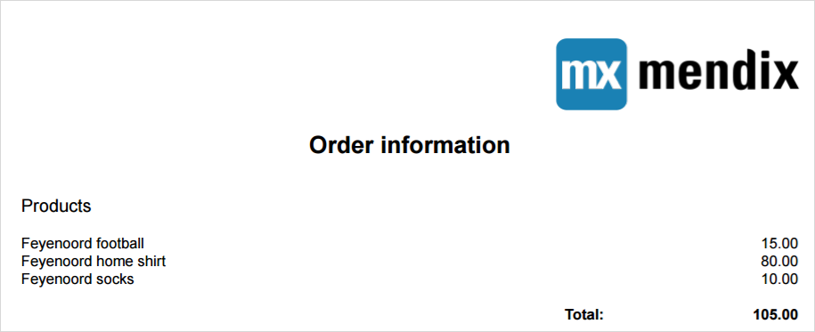

## 1 Introduction

Always wondered how to create your own documents with Mendix? Then this how-to is a good read for you!

With Mendix you have the possibility to generate documents in different ways and we will teach you the fundamentals to generate a document from your own application.

Before we start, we recommend you to first read the following two reference guides.

https://docs.mendix.com/refguide7/document-templates

https://docs.mendix.com/refguide7/generate-document 

## 2 Know your document

Before you start with producing a document with Mendix it is advised to make a draft version of the document you want to produce. You can sketch something on a piece of paper or have your customer provide you with an example. Either way it is good to have in mind what you want to achieve.

Based on the desired document you can determine your strategy for producing such a document. Mendix can offer you numerous options with the out-of-the-box document template functionality to produce documents but it can happen that the Mendix features would not suffice for your document generation. Don’t worry, just look at the end of this how-to for alternative ways of producing documents with Mendix. For our example, we’ve concluded that the Mendix functionality does suffice. So, let’s have a look at how this works with an example.

## 3 The business case

In this application, we have customers that can purchase products. They will do so by creating orders and select the products they want to purchase. To be able to present the customer with an overview of their order we have decided to create a PDF. This is something that the customer can download from their confirmation email where the PDF is added as an attachment. On the order, we want to show the information of the customer, show a logo of our company, the products with their price and the sum of the order.

## 4 Generate a document with out-of-the-box Mendix functionality

### 4.1 The domain model

The domain model that belongs to this case looks like you can see in figure 1. The Customer withholds address information and the language of the communication preference. The Order owns the date and sum of all OrderLines. The OrderLine entity has the customer specific price for a Product. Because we want to generate a document we’ve added the OrderDocument entity. This entity inherits from the System.FileDocument entity.

{}
Do not use the Sytem.FileDocument entity directly because you have no control over the security of that part from the System module.
{}

_Figure 1: Domain model of the order module_

### 4.2 The microflow

Now the domain model has been set up, we are ready to create the microflow for our new generate document function.

Let’s start with a new folder to organize all order document creation related sources.

_Figure 2: Folder structure_

Now we need a microflow that has the purpose to handle the creation of the document.

_Figure 3: The generate document microflow_

The microflow will be having the default start and endpoint at this moment.

_Figure 4: The empty microflow_

After the microflow creation we think of what information we would like to use in our document. Let’s start with an ‘Order’ as input information. At a later moment, we can see if we need any other data and could retrieve that via the order instance.

{}
When you create microflows it is a best practice to limit the number of input parameters to promote reuse.
{}

_Figure 5: Adding an input parameter_

In the next step, we will create a new OrderDocument. This object is needed to store the actual document. Here we will set the reference to the Order variable and set the name of the document.

_Figure 6: Create an order document_

Now we need to have a Language object. In our case, we have setup the Customer to withhold information about the communication language preference. In our microflow example, we first retrieve the Customer via the Order and then retrieve the Language from that Customer.

_Figure 7: Get the customer communication language_

The next step is to use the generate document activity. Within this activity, we can use the available variables and select the document template to create the document.

The document template does not exist yet at this moment so let’s create it first and place this in our folder.

_Figure 8: Added document template_

_Figure 9: Document template configuration_

{}
Based on the changes we will make in the selected template, the arguments will change.
{}

_Figure 10: Added document template activity_

After we have configured the general settings of the document template we do not need a seperate commit for the NewOrderDocument. This variable is automatically committed via the Document template activity.

Now that you have setup the generate document configuration we can have a look at configuring the template itself.

{}
Make sure to set the correct entity access for entities and its attributes used in the document template. Read access is a must for those attributes that are shown in the template. See screenshot below of the Customer entity that is configured to be read and write by the module role ‘User’.
{}

_Figure 11: Access rules of Customer_

### 4.3 The document template

In our example, we have composed the following template. 

_Figure 12: Document template_

In this template, we start with a dataview that has the information of the Order. From this Order, we can get the Customer information and the information about the purchased Products.

Within the dataview we make use of tables, table cells, labels, pictures, line breaks and a template grid to compose our document.

Now that we have created our document template we will see that there is an error in the error dock.

_Figure 13: Error dock_

To resolve this error, we need to open our microflow and open the ‘generate document’ activity. At opening the activity, the parameter mapping will directly be updated and allocates the variable to the mapping parameter.

Now, your generate document configuration should look like below.

_Figure 14: Document template_

The document template is now configured and the microflow is ready to be used. If we call this microflow as a submicroflow we can add a download activity in the overarching microflow.

This microflow could look something like below. Here we call our submicroflow, retrieve the created document and download the file.

_Figure 15: Main microflow that makes use of new function_

The result of the document template is as shown below.

_Figure 16: PDF result of the used template_

In our example, we retrieved our OrderLine information via the Entity(path) datasource. An alternative way is to use a microflow that returns the objects for the list presentation. If you do, make sure to add the correct userrole(s) to the microflows that are being used as datasource microflows within the document template.

## 5 Alternative ways to create documents

Next to the out-of-the-box Mendix functions we also know the following 2 other ways of generating documents with your Mendix app.

### 5.1 AppStore module

In the Mendix AppStore there is a module available which you can find at https://appstore.home.mendix.com/link/app/2026/.

More information on this way of working can be found in the following blog http://www.appronto.nl/over-appronto/blog/word-merging-for-mendix-finally.

### 5.2 Java API

The other way is via a Java API called IText. This is a free to use Java library.

More information on this way of working can be found on http://developers.itextpdf.com/developers-home