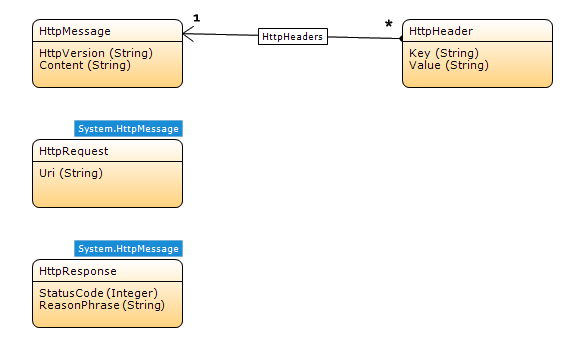

*HttpRequest* is a system entity that represents a request to a server. *HttpResponse* represents the response from the server. Use these entities when [publishing](published-rest-services) or [consuming](consumed-rest-services) REST services

### HttpRequest

The *HttpRequest* entity has the following attributes:

|  Attribute  |  Type  |  Default value | Description  |
|  ---  |  ---  |  ---  |
|  *HttpVersion* (inherited from *HttpMessage*) |  String  | HTTP/1.1 | The protocol version. You can almost always ignore this value. |
|  *Uri*  | String  | empty | The full URI for the incoming request, including query parameters. |
|  *Content* (inherited from *HttpMessage*) |  String  | empty | The body of the request. |

You can retrieve the request headers via the *HttpHeaders* association.

### HttpResponse

The *HttpResponse* entity has the following attributes:

|  Attribute  |  Type  |  Default value | Description  |
|  ---  |  ---  |  ---  |
|  *HttpVersion* (inherited from *HttpMessage*)  |  String  | HTTP/1.1 | The protocol version. You can almost always ignore this value. |
|  *StatusCode*  |  Integer  | 200 | The HTTP status code returned by the server.  |
|  *ReasonPhrase*  |  String  |  OK | A textual representation of the *StatusCode*.  |
|  *Content*  |  String  | empty | The body of the response. |

You can retrieve or create response headers via the *HttpHeaders* association.

For more information on HTTP status codes, see the [W3C Specification of Status Code Definitions](https://www.w3.org/Protocols/rfc2616/rfc2616-sec10.html).
