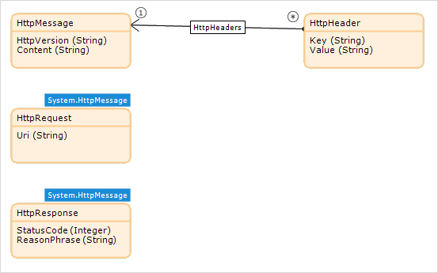

## 1 Introduction

`HttpRequest` is a system entity that represents a request to a server. `HttpResponse` represents the response from the server. Use these entities when [publishing](published-rest-services) or [consuming](consumed-rest-services) REST services.

## 2 HttpRequest

The `HttpRequest` entity has the following attributes:

|  Attribute  |  Type  |  Default Value | Description  |
|  ---  |  ---  |  ---  |  ---  |
|  `HttpVersion` (Inherited from `HttpMessage`) |  String  | HTTP/1.1 | The protocol version. You can almost always ignore this value. |
|  `Uri`  | String  | empty | The full URI for the incoming request, including query parameters. |
|  `Content` (inherited from `HttpMessage`) |  String  | empty | The body of the request. |

You can retrieve the request headers via the `HttpHeaders` association.

## 3 HttpResponse

The `HttpResponse` entity has the following attributes:

|  Attribute  |  Type  |  Default Value | Description  |
|  ---  |  ---  |  ---  |  ---  |
|  `HttpVersion` (inherited from `HttpMessage`)  |  String  | HTTP/1.1 | The protocol version. You can almost always ignore this value. |
|  `StatusCode`  |  Integer  | 200 | The HTTP status code returned by the server.  |
|  `ReasonPhrase`  |  String  |  OK | A textual representation of the `StatusCode`.  |
|  `Content`  |  String  | empty | The body of the response. |

For more information on HTTP status codes, see the [W3C Specification of Status Code Definitions](https://www.w3.org/Protocols/rfc2616/rfc2616-sec10.html).

You can retrieve or create response headers via the `HttpHeaders` association.

An important `HttpResponse` header is `Content-Type`, which indicates how the content should be interpreted. For more information on this header, see the [W3C specification of Content-Type](https://www.w3.org/Protocols/rfc1341/4_Content-Type.html).
