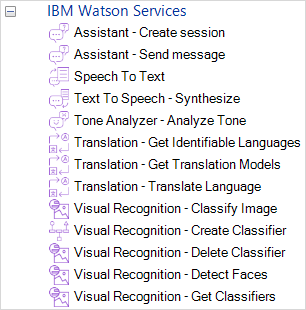
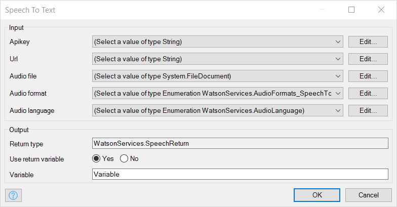
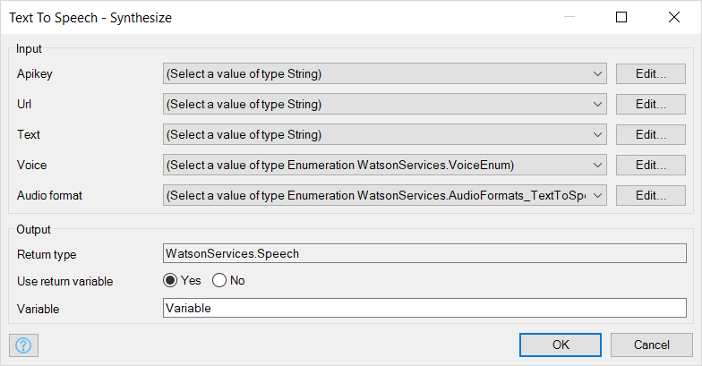
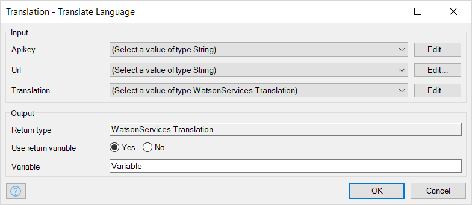
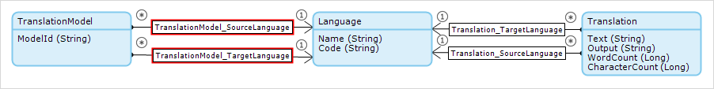
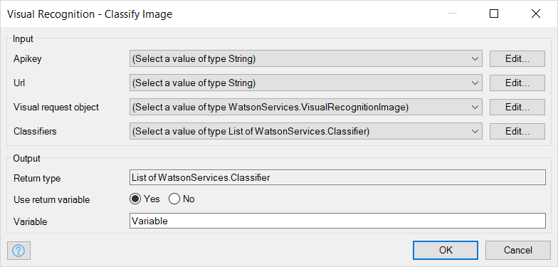
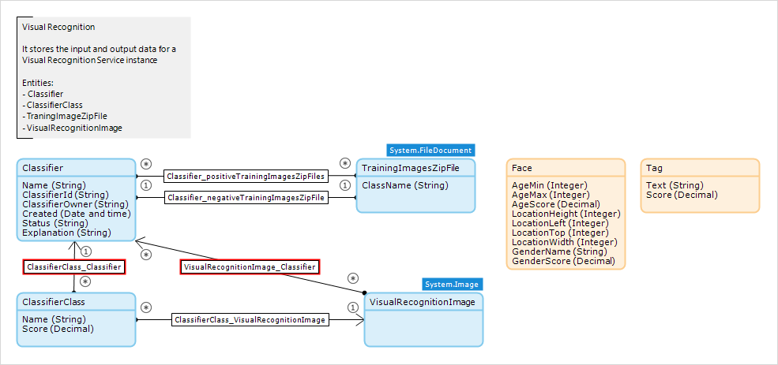
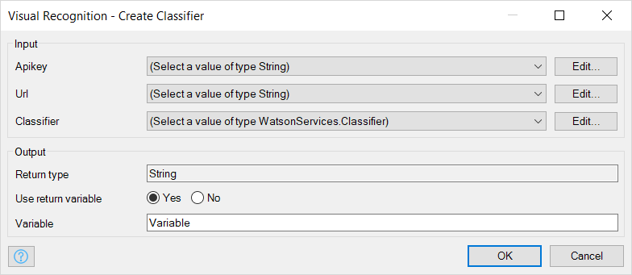
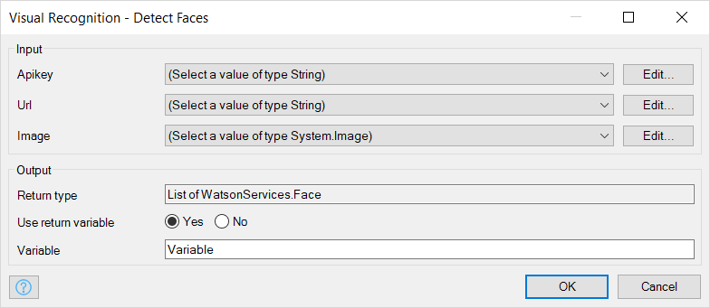
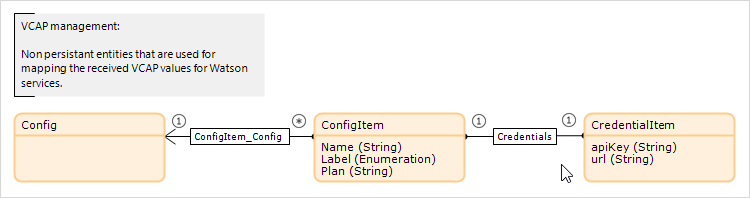

## 1 Introduction

IBM Watson is a suite of services which gives you access to a range of AI techniques and applications. These services are available over the web and cover the following areas:

* Conversation
* Knowledge
* Vision
* Speech
* Language
* Empathy

You can find out more about Watson on the [IBM Watson website](https://www.ibm.com/watson/products-services/).

The [IBM Watson Connector Suite](https://appstore.home.mendix.com/link/app/2860/) in the Mendix App Store provides connectors which simplify the use of the Watson services. Including the IBM Watson Connector Suite in your app allows you to add microflow actions which make use of IBM Watson services. The IBM Watson Connector Suite is based on version 3.5.3 of the SDK.

### 1.1 Prerequisites

#### 1.1.1 IBM Cloud

To use IBM Watson services you must have an account on [IBM Cloud](https://www.ibm.com/cloud/). There are various pricing points for this, and there are free options available to allow you to try out IBM services. You can then add Watson services to projects on your IBM Cloud account: see [Getting started with Watson and IBM Cloud](https://console.bluemix.net/docs/services/watson/index.html). Once you have added a service to your account you will be given credentials which you use each time you want to access the service.

To view the credentials:

* Go to your existing services.
* Select the top-left menu, and then select Watson to get to the Watson console.
* Select Existing Services from Watson Services to view a list of your services and projects.
* If the service is part of a project, click the name of the project that contains the service. View the credentials from the Credentials section on the project details page.
* If the service is not part of a project, click the service name that you want to view and then select Service credentials.

For more information see [Service credentials for Watson services](https://console.bluemix.net/docs/services/watson/getting-started-credentials.html).

If you are running your app on IBM Cloud and the Watson resources have been added to your IBM Cloud project, the credentials can be picked up automatically via VCAP. See section [3 Watson Service Configuration](#WatSerCon) for more information on VCAP and the IBM Watson Connector Suite configuration for storing credentials. If you are testing your app locally, or in another environment, you will need to enter these credentials (API key or Username and Password) manually when you use the connector in your Mendix app.

#### 1.1.2 IBM Watson Connector Suite

Import the [IBM Watson Connector Suite](https://appstore.home.mendix.com/link/app/2860/) from the App Store into your project. This will give you access to the connector actions within your microflows. IBM starter apps for Watson have the Suite already included.

To use these actions, just drag them into your microflow. Each of the connectors is described in the following section.

{}
Not all Watson services are currently supported by the IBM Watson Connector Suite. More services will be added over time.

These connectors are based on version 3.5.3 of the Watson SDK.

If there is no connector for the service you want, you can use Mendix native REST to use the service yourself. See [How to Consume a REST Service](https://docs.mendix.com/howto/integration/consume-a-rest-service).
{}

## 2 Connector Actions

### 2.1 Conversation — send message

This action sends a message from your app to the [IBM Watson Conversation service](https://console.bluemix.net/docs/services/conversation/index.html). This will use a selected workspace to analyze the message and return an appropriate response.

{}
Watson Conversation has recently been renamed Watson Assistant.
{}

To use IBM Watson Conversation, you must first create a Workspace for your IBM Cloud service. A workspace sets up the context for a conversation and allows you to define routes through a dialog. Watson uses natural-language processing and machine learning to choose the appropriate response within the dialog defined in the workspace.

The easiest way to set up a workspace is through the IBM Watson Conversation Workspaces Tool. Here you can create a copy of the Watson sample workspace, or create your own workspace from scratch. More information about workspaces and how they need to be set up is available on [Configuring a Watson Assistant workspace](https://console.bluemix.net/docs/services/conversation/configure-workspace.html).

#### 2.1.1 Username

A string containing the username assigned to the conversation service in your IBM Cloud project.

#### 2.1.2 Password

A string containing the password assigned to the conversation service in your IBM Cloud project.

#### 2.1.3 Input

A string containing the input to the conversation. This string cannot contain carriage return, newline, or tab characters, and it must be no longer than 2048 characters. 

#### 2.1.4 Conversation context

An object of type ConversationContext which contains the context for this conversation.

The ConversationContext object keeps track of where you are in a conversation so that Watson can interpret your response in the light of what has been said before. For example, if you have been in a dialog about the weather, Watson will recognize that you are still in that part of the conversation.

The ConversationContext contains the ConversationId. This is a unique identifier for this conversation which is used by Watson to maintain the state of the dialog. The rest of the domain model around ConversationContext is used internally to manage the context of the conversation.

#### 2.1.5 Variable (ConversationMessageResponse)

The name you wish to assign to an object of type ConversationMessageResponse which is the response received from Watson.

The ConversationMessageResponse contains to following:

* Input — the input which was sent to Watson. This is the same as the input string above
* Output — the response from Watson to the input
* ConversationId — the ConversationId. This is the same as the ConversationId passed in the Conversation context.

### 2.2 Speech To Text — Recognize Audio

This action uses the IBM Speech to Text service to transcribe audio to text. Audio can be supplied in a number of common formats and the service uses machine intelligence to transcribe the text into one of a number of possible target languages.

#### 2.2.1 Username

A string containing the username assigned to the speech to text service in your IBM Cloud project.

#### 2.2.2 Password

A string containing the password assigned to the speech to text service in your IBM Cloud project.

#### 2.2.3 Audio file

An object of type, or a specialization of type, FileDocument containing the audio stream to be analyzed. The stream must be encoded in the format described in the audio format parameter.

#### 2.2.4 Audio format

The format of the audio file which is to be transcribed. These are listed in the enumeration AudioFormats. The supported formats are:

* BASIC
* FLAC
* OGG
* OGG-VORBIS
* PCM
* RAW
* WAV

For more detail see the [IBM Cloud documentation on audio formats](https://console.bluemix.net/docs/services/speech-to-text/audio-formats.html)

#### 2.2.5 Audio language

This is the language in which the text detected in the speech file should be transcribed. These are listed in the AudioLanguage enumeration. More information on the available languages is available in the [Speech to Text API Reference](https://www.ibm.com/watson/developercloud/speech-to-text/api/v1/) on the IBM Cloud site.

#### 2.2.6 Variable (SpeechReturn)

The name you want to give to the object of type SpeechReturn which is returned by the IBM Speech to Text Analyzer.

The domain model for this action allows for several interim responses. In this implementation, however, you will only get a final result (with `_final` set to true) because the connector cannot analyze a stream, only a complete file.

The text which has been decoded is in the object of type **Alternative** in the **transcript** attribute. The **confidence** indicates the service's confidence in the transcription in a range 0 to 1.

### 2.3 Text To Speech — Synthesize

This connector uses the [IBM Text to Speech service](https://console.bluemix.net/docs/services/text-to-speech/index.html) to 'speak' some text. It converts a string containing text into a sound object corresponding to the synthesis of the text using a specified voice. This voice can sound male or female and is optimized for a particular language. Some voices can, depending on their capabilities, add extra vocal signals such as speed, timbre, or emotional cues. See [SSML](https://console.bluemix.net/docs/services/text-to-speech/SSML.html) for more information.

#### 2.3.1 Username

A string containing the username assigned to the text-to-speech service in your IBM Cloud project.

#### 2.3.2 Password

A string containing the password assigned to the text-to-speech service in your IBM Cloud project.

#### 2.3.3 Text

A string containing the text to be 'spoken'. This can also contain additional XML instructions on how the text should be performed. For example you can make certain phrases slower or louder than Watson would normally speak them. Depending on the **Voice** chosen, you can add more sophisticated expression to the text. More information is available in IBM's [SSML documentation](https://console.bluemix.net/docs/services/text-to-speech/SSML.html).

#### 2.3.4 Voice

An object of type VoiceEnum which instructs the IBM Watson service how to synthesize the spoken text.

Note that the voice chosen should match the language of the **Text**. There is no validation that the two match and using, for example, a Spanish **Voice** to synthesize English **Text** may have unexpected results.

#### 2.3.5 Variable (Speech)

The name you wish to assign to an object of type Speech which contains the sound response received from Watson.

### 2.4 Tone Analyzer — Analyze Tone

This connector uses the [IBM Watson Tone Analyzer](https://console.bluemix.net/docs/services/tone-analyzer/index.html) to detect emotional and language tones in written text.

#### 2.4.1 Text

A string containing the text to be analyzed. You can submit no more than 128 KB of total input content and no more than 1000 individual sentences. The text is analyzed as being in English.

#### 2.4.2 Username

A string containing the username assigned to the tone analyzer service in your IBM Cloud project.

#### 2.4.3 Password

A string containing the password assigned to the tone analyzer service in your IBM Cloud project.

#### 2.4.4 Variable (ToneAnalyzerResponse)

The name you wish to assign to an object of type ToneAnalyzerResponse which is the response received from Watson. This is associated with the responses from the Tone Analyzer.

You can retrieve two sorts of tone.

1. The tone of the whole document

    Via the association **Tone_Categories** are one or more ToneCategory objects categorizing the tone of the whole document. These are categories such as emotional_tone or language_tone.

    From the ToneCategory, via the association **Tones** are one or more **Tone** objects which contain the tones of the document in this category. Each Tone object has a **Name** and a **Score** which indicates to what extent this tone exists in the document. For example a document may have a 0.5 score for joy in the category emotional_tone.

2. The tone of each sentence

    The document is also broken up into sentences using punctuation and line breaks to identify individual sentences.

    Via the association **Sentence_Tones** are one or more SentenceTone objects containing the sentence start position (InputFrom), end position (InputTo), and content (Text) for each sentence.

    From the SentenceTone, via the association **Sentence_Tone_Categories** are one or more ToneCategory objects categorizing the tone of each sentence.

    From the ToneCategory, you can use the associations in the same way as for the whole document to find the tones in the selected sentence.

### 2.5 Translation — Get Identifiable Languages

This action returns a list of languages which are recognized by Watson. Each language is represented by a code and a name.

{}
Note that this is NOT the list of languages which**Translate Language** can translate. The list needs further refinement and committing to the Mendix database before it can be used successfully in the **Translate Language** action.
{}

#### 2.5.1 Username

A string containing the username assigned to the translation service in your IBM Cloud project.

#### 2.5.2 Password

A string containing the password assigned to the translation service in your IBM Cloud project.

#### 2.5.3 Variable (list of Language)

The name you wish to assign to a list of objects of type Language which is the response received from Watson.

Each language object consists of two attributes:

* Name — the English name of the language
* Code — a code representing the language (e.g. **en** for English)

### 2.6 Translation — Translate Language

This action translates a piece of text from one language to another using the default translation model for that pair of languages.

The languages are not explicit in the parameters of the action, but are identified by associating the **Translation** object which is passed with two **Language** objects via the following associations:

* Translation_TargetLanguage – the language you are translating to
* Translation_SourceLanguage – the language you are translating from

{}
Note that not all pairs of languages are supported. For example, you can translate to and from English and Spanish and English and Portuguese. However, there is no model in Watson to translate Spanish to Portuguese. The IBM Watson Connector Suite does not check whether there is a valid model before it passes the language pair to Watson.

Additionally, the current version of the IBM Watson Connector Suite supports only a subset of all the language pairs supported by IBM Watson. These all use the default translation models and are:

* Arabic — using model ar-en
* English — using models en-ar, en-fr, en-it, en-pt, and en-es
* French — using models fr-en and fr-es
* Italian — using model it-en
* Portuguese — using model pt-en
* Spanish — using models es-en and es-fr
{}

The IBM website contains more information on the [IBM Watson Language Translator](https://console.bluemix.net/docs/services/language-translator/index.html).

#### 2.6.1 Translation

This is a translation object. For a successful translation it must have:

* **Text** attribute containing the text to be translated
* Association to a **Language** object representing the source language of the text via the Translation_SourceLanguage association. This must be one of the supported languages for Watson Translate
* Association to a **Language** object representing the target language of the text via the Translation_TargetLanguage association. This must be one of the supported languages for Watson Translate and be supported by a translation model for translating between the source and target languages

#### 2.6.2 Username

A string containing the username assigned to the translation service in your IBM Cloud project.

#### 2.6.3 Password

A string containing the password assigned to the translation service in your IBM Cloud project.

#### 2.6.4 Variable (Translation)

The name you wish to assign to an object of type Translation which is the response received from Watson.

This object will contain the following attributes:

* **Text** — the original text to be translated
* **Output** — the text translated into the target language
* **WordCount** — the number of words in the original text
* **CharacterCount** — the number of characters in the original text

    and associations

* Translation_TargetLanguage – the language you have translated to
* Translation_SourceLanguage – the language you have translated from

### 2.7 Visual Recognition — Classify Image

This action passes an image to Watson which uses either its default classifiers or custom classifiers to analyze the image and identify the contents.

#### 2.7.1 Visual request object

This is an object of type **VisualRecognitionImage** which contains the image which is to be classified. The image must be in jpg or png format and be less that 10MB.

#### 2.7.2 Apikey

A string containing the API key assigned to the Watson vision service in your IBM Cloud project.

#### 2.7.3 Classifiers

A list of the classifiers which Watson should use to classify the image. If you have not created your own classifier, you need to tell Watson to use the default classifier by using a Classifier object containing

* Name — "default"
* ClassifierId — "default"
* ClassifierOwner — "IBM" or empty

#### 2.7.4 Variable (list of Classifier)

The name of the list of Classifier objects returned from Watson.

Associated with each of the classifier objects will be zero or more **Classifier_Class** objects. Each of these contain the **Name** of content which Watson has identified using the classifier, and the **Score** which is an indication of the confidence that Watson has that it has correctly identified the content, with 1.0 indicating complete confidence in the identification.

### 2.8 Visual Recognition — Create Classifier

This action allows you to train a new classifier by uploading zip files containing images.

There should be two files containing zipped examples in jpg or png format with at least 10 images in each file. One file contains positive examples: images which depict the visual subject of this classifier. One file contains negative examples: images which are visually similar to the positive images, but do not contain the visual subject of this classifier. For example, if you want to identify dogs you could upload one file containing images of dogs, and a negative one containing images of cats.

Each zip file has a maximum size of 100MB and contains less than 10,000 images.

#### 2.8.1 Apikey

A string containing the API key assigned to the Watson vision service in your IBM Cloud project.

#### 2.8.2 Classifier

{}
The IBM Watson Connector Suite currently supports only one positive and one negative training file.
{}

An object of type Classifier. This is associated with the following objects.

* one TrainingImagesZipFile objects via the association Classifier_positiveTrainingImagesZipFile. This is the positive example files described above.
* one TrainingImagesZipFile objects via the association Classifier_negativeTrainingImagesZipFile. This is the negative example file described above.

The **Name** attribute of the Classifier is the name of the classifier which will be created by Watson. For example Dogs for a classifier identifying dogs.

#### 2.8.3 Variable (String)

The name of a string containing the ID of the new classifier.

### 2.9 Visual Recognition — Detect Faces

This action allows you to analyze and get data about faces in images. Responses can include estimated age and gender, and the service can identify celebrities.

#### 2.9.1 Apikey

A string containing the API key assigned to the Watson vision service in your IBM Cloud project.

#### 2.9.2 Image

An object of type, or a specialization of, System.Image containing the image in which faces should be detected.

#### 2.9.3 Variable (list of Face)

The name you wish to assign to a list of objects of type Face. Each object contains information about a face which has been detected in the image.

Each face object will contain the following:

* AgeMin — Minimum age of this face
* AgeMax — Maximum age of this face
* AgeScore — A confidence score for the detected ages, in the range 0 to 1
* LocationHeight — Height of the detected face, in pixels
* LocationLeft — X-position of the top-left pixel of the face region
* LocationTop — Y-position of the top-left pixel of the face region
* LocationWidth — Width of the detected face, in pixels
* GenderName — The gender of the detected face
* GenderScore — A confidence score for the detected gender, in the range 0 to 1
* IdentityName — The name of a detected famous person, empty if no famous person is identified
* IdentityScore — A confidence score for the detected identity, in the range 0 to 1
* TypeHierarchy — A hierarchy indicating the sphere in which the person is famous. For example a president of the USA might have a hierarchy: People/Leaders/Presidents/USA/{IdentityName}

{}
If there are more than ten faces in an image, these will all be detected but the age and gender confidence may return scores of zero.
{}

## 3 Watson Service Configuration

Functionality to store the API keys and username/password combinations which are required to access IBM Watson services is built into the Watson Connector Suite example app. An IBM Watson service will require either an API key, or a username/password combination, depending on how the service has been configured.

If the app is running on IBM Cloud, then it can use VCAP to obtain the credentials for the configured services. Support for this functionality is in the project module **WatsonServices** in the folder **USE_ME**.
If the app is not running on IBM Cloud (for example if you are testing it locally or on a Mendix cloud), then the credentials will have to be supplied manually.

### 3.1 Get Credentials through VCAP

An example of how to check for the VCAP services and import the configured credentials is in the WatsonServices microflow **USE_ME > OnStartUpWatsonAppOnIBMCloud**. This is configured to run automatically in **Project Settings > Runtime > After startup**.

The microflow does the following:

* Calls CFCommons.getEnvVariables to get an environment variable **VCAP_SERVICES**
* If the variable does not exist, the microflow ends and returns **false**
* If the VCAP_SERVICE environment variable does exist, it will contain the credentials of all  the services which have been allocated to your project on IBM Cloud. This is in JSON format.
* The action **Import with mapping** is used, together with the mapping **USE_ME > JsonMapping > VCAP_Import_Mapping** to populate an object of type **Config**. See [Import Mapping Action](../import-mapping-action) for more information

    

* A list of all the **ConfigItem** objects associated with the **Config** item which has just been created are retrieved
* This list is passed to the microflow **IVK_CreateOrUpdateService** which creates an object of type **WatsonServiceConfig** for each item in the list which contains credentials for a Watson service.

The credentials are now stored in the database and can be used with IBM Watson Services actions.

### 3.2 Enter Credentials Manually

If VCAP is not available, then the WatsonServiceConfig objects will have to be entered manually. This can be done in a number of ways. Two examples are:

1. Create simple Mendix overview and newedit pages to allow an administrator to enter the credentials. In WatsonServicesExamples you can see samples of these in the **Config** folder.

2. Put the credentials in constants and run an **After start** microflow to populate the database when the application is run for the first time.

### 3.3 Using the Credentials

The microflow **GetWatsonServiceConfiguration** takes a parameter of WatsonServiceConfigType, checks to see that a configuration of that type has been set up as a **WatsonServiceConfig** object, and returns the object if it exists. If the object does not exist, it posts a message to the log and returns an empty object.

The WatsonServiceConfig entity has the following attributes:

* Username — a string containing a username used to access an IBM Watson service
* Password — a string containing a password associated with the username used to access an IBM Watson service
* Apikey — a string containing an API key used to access an IBM Watson service
* Label — a label identifying the service for which these credentials are stored. It is an enumeration of WatsonServiceConfigType

## 4 Not yet supported

The following Watson services are not yet supported by the IBM Watson Connector Suite. However, you can connect to them yourself using the native Mendix activities for consuming REST services. See [How to Consume a REST Service](https://docs.mendix.com/howto/integration/consume-a-rest-service).

1. Discovery

    IBM Watson™ Discovery makes it possible to rapidly build cognitive, cloud-based exploration applications that unlock actionable insights hidden in unstructured data — including your own proprietary data, as well as public and third-party data.

2. Personality Insights

    The IBM Watson™ Personality Insights service provides an Application Programming Interface (API) for deriving insights from social media, enterprise data, or other digital communications. The service uses linguistic analytics to infer individuals' intrinsic personality characteristics from digital communications such as email, text messages, tweets, and forum posts.

    The service infers, from potentially noisy social media, portraits of individuals that reflect their personality characteristics. It can also determine individuals' consumption preferences, which indicate their likelihood to prefer various products, services, and activities.

3. Natural Language Classifier

    With IBM Watson™ Natural Language Understanding, developers can analyze semantic features of text input, including categories, concepts, emotion, entities, keywords, metadata, relations, semantic roles, and sentiment.

Additionally, the IBM Watson Connector Suite does not yet have actions for all the APIs of the services which it does support. For example the APIs which allow you to build a conversation without using the IBM Watson Conversation Workspaces Tool.

<!--## 7 Example User Scenarios

This section presents example user scenarios that can be referenced when using these features.

[//]: # (### 7.1 {Example User Scenario})

## 5 Related Content

* [Getting started with Watson and IBM Cloud](https://console.bluemix.net/docs/services/watson/index.html)
* [How to Consume a REST Service](https://docs.mendix.com/howto/integration/consume-a-rest-service)
* [IBM Cloud](https://www.ibm.com/cloud/)
* [IBM Watson Language Translator service](https://console.bluemix.net/docs/services/language-translator/index.html)
* [IBM Watson Language Translator service — API Reference](https://www.ibm.com/watson/developercloud/language-translator/api/v2/)
* [IBM Watson Connector Suite](https://appstore.home.mendix.com/link/app/2860/)
* [IBM Watson Conversation service](https://console.bluemix.net/docs/services/conversation/index.html)
* [IBM Watson Conversation service — API Reference](https://www.ibm.com/watson/developercloud/conversation/api/v1/)
* [IBM Watson Conversation service — Configuring a Watson Assistant workspace](https://console.bluemix.net/docs/services/conversation/configure-workspace.html)
* [IBM Watson Discovery service](https://console.bluemix.net/docs/services/discovery/index.html)
* [IBM Watson Natural Language Classifier](https://console.bluemix.net/docs/services/natural-language-classifier/natural-language-classifier-overview.html)
* [IBM Watson Personality Insights service](https://console.bluemix.net/docs/services/personality-insights/index.html)
* [IBM Watson Speech to Text service](https://console.bluemix.net/docs/services/speech-to-text/index.html)
* [IBM Watson Speech to Text service — API Reference](https://www.ibm.com/watson/developercloud/speech-to-text/api/v1/) 
* [IBM Watson Speech to Text — audio formats](https://console.bluemix.net/docs/services/speech-to-text/audio-formats.html)
* [IBM Watson Text to Speech service](https://console.bluemix.net/docs/services/text-to-speech/index.html)
* [IBM Watson Text to Speech service — API Reference](https://www.ibm.com/watson/developercloud/text-to-speech/api/v1/)
* [IBM Watson Text to Speech — SSML documentation](https://console.bluemix.net/docs/services/text-to-speech/SSML.html)
* [IBM Watson Tone Analyzer service](https://console.bluemix.net/docs/services/tone-analyzer/index.html)
* [IBM Watson Tone Analyzer service — API Reference](https://www.ibm.com/watson/developercloud/tone-analyzer/api/v3/)
* [IBM Watson Visual Recognition service](https://console.bluemix.net/docs/services/visual-recognition/index.html)
* [IBM Watson Visual Recognition service — API Reference](https://www.ibm.com/watson/developercloud/visual-recognition/api/v3/)
* [IBM Watson website](https://www.ibm.com/watson/products-services/)
* [Service credentials for Watson services](https://console.bluemix.net/docs/services/watson/getting-started-credentials.html)
