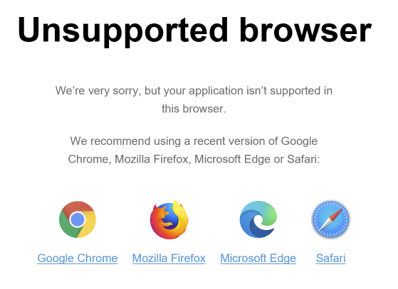

## Introduction
To match our customers expectations and to align with the best practices of the modern web ecosystem, we have decided to drop support for Internet Explorer 11 in Mendix 9. This will allow us to keep innovating using modern web features, as well as make it possible to decrease the loading times and improve the performance of applications.

As of Mendix 9, users still using IE will be shown a message saying that upgrading to a modern browser is required.

This message [can be customized to your needs](/howto/front-end/customize-styling-new##customize-unsupported-browsers).

### What if I still need to support IE11
Mendix 8 and lower will continue supporting IE11, we suggest using those until your users have upgraded.
