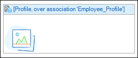

## 1 Introduction

An image viewer can be used to display an image or its thumbnail.

{}

This image viewer shows the product image.

{}

An image viewer must be placed in a data view or template grid.

## 2 Common Properties

{}

{}

{}

## 3 Data Source Properties

### 3.1 Entity (Path)

The entity (path) property specifies which entity will be shown in the image viewer. It starts in the data view entity and must end in System.Image or a specialization thereof. If the data view entity itself is (a specialization of) System.Image you can use this entity on the image viewer as well.

## 4 Events

### 4.1 On Click

This property specifies what happens when the image is clicked:

| Value | Meaning |
| --- | --- |
| Do nothing | Nothing happens. |
| Call microflow | The specified microflow is executed. |
| Enlarge | The image is shown at full size. |

_Default value:_ Do nothing

{}On click events are not supported on native mobile pages.{}

### 4.2 Microflow (for Call Microflow)

This property specifies the microflow that will be executed when the image is clicked.

### 4.3 Microflow Settings (for Call Microflow)

The on click settings specify what parameters will be passed to the microflow, whether to show a progress bar or not, and more.

See [Starting Microflows](starting-microflows).

## 5 General Properties

### 5.1 Default Image

This is the image that is displayed if no image is uploaded.

### Width Unit

The width of an image can be specified in three ways: pixels, percentage or auto. 

| Value | Definition |
| --- | --- |
| Pixels | The width is specified in a number of pixels. If you specify both width and height, the image will be scaled proportionally in the rectangle you define. |
| Percentage | The width is specified in a percentage of the container of the image. It can be larger than its original width in which case the image is stretched. |
| Auto | The width of the given image is used. |

*Default value*: Percentage

{}
Not supported on native mobile pages.
{}

### Width

The width of the image in pixels or percentage (see width unit). In the case of 'Auto', no value needs to be specified.

*Default value*: 100

### Height Unit

The height of an image can be specified in three ways: pixels, percentage or auto. 

| Value      | Definition                                                   |
| ---------- | ------------------------------------------------------------ |
| Pixels     | The height is specified in a number of pixels. If you specify both width and height, the image will be scaled proportionally in the rectangle you define. |
| Percentage | The height is specified in a percentage of the container of the image. It can be larger than its original height in which case the image is stretched. |
| Auto       | The height of the given image is used. |

*Default value*: Auto

{}Not supported on native mobile pages.{}

### Height

The height of the image in pixels or percentage (see height unit). In the case of 'Auto', no value needs to be specified.

*Default value*: not applicable

### Responsive

This property influences how the image scales. If the value is 'Yes', the image will never get bigger than its original size. It can become smaller. If the value is 'No', the image can become both larger and smaller than its original size.

*Default value*: Yes

### 5.2 Show

This property indicates whether the generated thumbnail is shown or the full image.

_Default value:_ Thumbnail

## 6 Visibility Properties

{}

{}

## 7 Related Articles

*   [Data view](data-view)
*   [Entities](entities)
