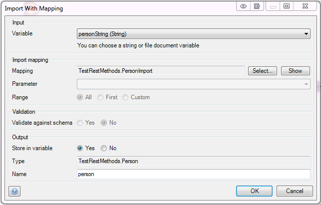

## 1 Introduction

With the import mapping action, you can import the data stored in an XML or JSON document into [domain model](domain-model) entities.

## 2 Input Properties

### 2.1 File Document

The input variable can either be a string variable or a file document variable. The contents should have an XSD or JSON representation.

It the variable is a file document, it should be an object of the `System.FileDocument` entity or a specialization thereof.

## 3 Action Properties

### 3.1 Import Mapping

The [import mapping](import-mappings) defines how to transform the XML or JSON string (or file document) to objects.

### 3.2 Input Content Type

If the import mapping is based on a message definition, it can import both XML and JSON. Select whether the input variable contains XML or JSON.

### 3.3 The Input Contains

If the import mapping is based on a message definition, it can import both single objects and lists. Select whether the input variable contains a single object or a list of objects.

### 3.4 Parameter

If the selected mapping requires a parameter, you can choose it here.

### 3.5 Range (If the Mapping Returns a List)

The range determines how many objects are mapped and returned.

| Range | Meaning |
| --- | --- |
| All | Map and return all objects. |
| First | Map and return only the first object. The result of the action will be a single object instead of a list. |
| Custom | Map and return a given number of objects (limit). The limit is a microflow expression that should result in a number. |

{}

Validation properties are only applicable if an import mapping is selected that maps from XML.

{}

## 4 Validation Properties

### 4.1 Validate Against Schema

Determines whether the import action should validate the incoming XML against the schema (XSD).

Setting this to yes can greatly decrease performance!

*Default value:* No

## 5 Output Properties

### 5.1 Store in Variable

Choose whether to store the result of the import in a variable.

### 5.2 Type

The type of the output variable.

### 5.3 Name

The name for the variable that will hold the result of the import.
