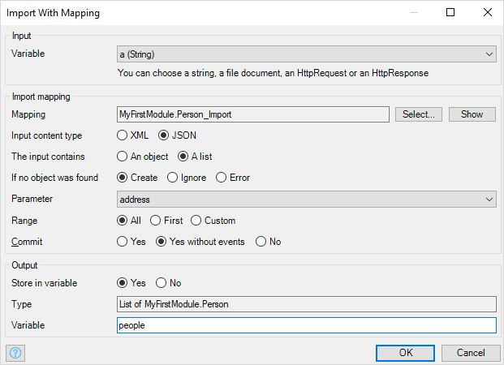

{}
This activity can only be used in microflows, not in nanoflows.
{}

## 1 Introduction

With the Import Mapping action, you can import the data stored in an XML or JSON document into [domain model](domain-model) entities.

## 2 Input

### 2.1 Variable

The input variable can either be a string, a file document, or an [HttpRequest](http-request-and-response-entities#http-request). The content of the file document or HttpRequest should be XML or JSON.

{}

Support for HttpRequest was added in version 7.11.0. Earlier versions needed a string variable that contained the HttpRequest content.

{}

## 3 Import Mapping

### 3.1 Mapping

The [import mapping](import-mappings) defines how to transform the XML or JSON into objects.

### 3.2 Input Content Type

{}

This feature was introduced in version 7.10.0.

{}

If the import mapping is based on a [message definition](message-definition), it can import both XML and JSON. Select whether the input variable contains XML or JSON.

### 3.3 The Input Contains

{}

This feature was introduced in version 7.10.0.

{}

If the import mapping is based on a [message definition](message-definition), it can import both single objects and lists. Select whether the input variable contains a single object or a list of objects.

### 3.4 If No Object Was Found

{}

This feature was introduced in version 7.17.0.

{}

You can indicate what should happen **if no object was found** when the import mapping has checked the box **decide this at the place where the mapping gets used**.
 
### 3.5 Parameter

If the selected mapping requires a parameter, you can choose it here.

### 3.6 Range (If the Mapping Returns a List)

The range determines how many objects are mapped and returned.

| Range | Meaning |
| --- | --- |
| All | Map and return all objects. |
| First | Map and return only the first object. The result of the action will be a single object instead of a list. |
| Custom | Map and return a given number of objects (limit). The limit is a microflow expression that should result in a number. |

### 3.7 Commit

Indicates whether the resulting objects should be committed to the database, and whether event handlers should be triggered.

| Option | Description |
| --- | --- |
| Yes | The objects are saved in the database and the [event handlers](event-handlers) are triggered |
| Yes without events | The objects are saved in the database, but the [event handlers](event-handlers) are not triggered (Default) |
| No | The objects are created without being saved in the database. You will need a [commit action](committing-objects) to save them |

## 4 Validation

{}

Validation properties are only applicable if an import mapping is selected that maps from XML based on an [XML schema](xml-schemas) or a [consumed web service](consumed-web-service).

{}

### 4.1 Validate Against Schema

Determines whether the import action should validate the incoming XML against the [XML schema](xml-schemas).

Setting this to _yes_ can greatly decrease performance!

*Default value:* No

## 5 Output

### 5.1 Store in Variable

Choose whether to store the result of the import in a variable.

### 5.2 Type

The type of the output variable.

### 5.3 Name

The name for the variable that will hold the result of the import.
