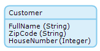

## 1 Introduction

Indexes are lists of attributes for which a database index is created on the underlying database table of the entity. Indexes improve the speed of retrieving objects if the indexed attributes are used in a search field, XPath constraint of a data grid or template grid, or in a `WHERE` clause of an OQL query. However, search fields of which the `Comparison` property has value `Contains` do not take advantage of the improved performance.

## 2 Important Considerations

Indexes are ordered, which means that when you create an index on two or more attributes, it is important to consider the order of the attributes. When performing a search or query on multiple attributes, these attributes should be in the same order as those in the index to take advantage of the improved performance. By extension, when the retrieval is constrained by only one attribute, the improved performance is only achieved if this is the first attribute in the index.

If an entity's `owner` and `changedBy` system members are selected, an index is created. This is not so for the `createdDate` and `changedDate` system members. In addition, an index is created for the automatically generated attribute `id`.

Only persistable entities can define indexes, as they are database concepts. Indexes are disabled for non-persistable entities.

Changing and deleting objects of an entity with indexes takes longer, because the index needs to be updated in addition to the actual data. Therefore, for attributes that are seldomly used as criteria in a search or query, only create an index if the increase in retrieval performance justifies the decrease in update performance.

## 3 Example

Customers are usually retrieved by a combination of ZIP code and house number. So, *one* index is set on the combination of the attributes:



The objects are retrieved by the following OQL query – pay attention to the order of the attributes in the `WHERE` clause:

```sql
FROM Module.Customer AS c
WHERE c.zipcode = $ParameterZipCode AND c.housenumber = $ParameterHouseNumber
SELECT c.name AS CustomerName
```
