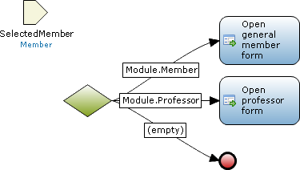

An inheritance split is an element that makes a choice based on the type of certain variable. For each specialization the microflow can continue in a different way. If you want to use the specialized type in the rest of the microflow you can use a [cast](cast-object) action.

See [Entities](entities) to read more about specialization and generalization.

## Input Properties

### Variable

The input variable is the variable of which the type is inspected to see how to continue.

{}

Let us say you have an entity Student and an entity Professor which have the entity Member as their generalization. For a professor you want to open a different form than for another member. The selected member is available in the parameter SelectedMember and is used as input variable for the inheritance split. Note that the sequence flow for Student is missing. If a sequence flow is missing, the closest generalization is searched that does have a sequence flow. In the case of Student this is Member. The sequence flow with the caption (empty) is followed when the parameter used as input variable does not contain an object.

{}

## Common Properties

### Caption

See [Microflow Element Common Properties](microflow-element-common-properties).
