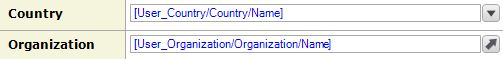
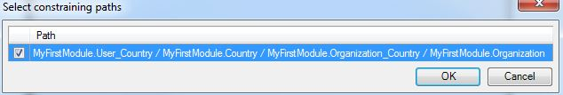

The input reference set selector is an [input widget](input-widgets) that can be used to display and edit [associations](associations) for which the multiplicity setting is configured to allow multiple parent objects to associate with multiple children. This type of association is also known as a reference set.

{}

The multiplicity settings of an association can be found by double-clicking the association in the [domain model](domain-model).

{}{}

This input reference set selector allows you to link a user to organizations.

{}

When clicked, the input reference set selector will open a select page containing a widget with all possible objects that can be used to fill the association.

## General Properties

### Select Page

The select page determines which page is displayed when the input reference selector is clicked. This page can be used to select associated objects from the list of all possible objects. This page should contain a data grid, template grid or list view connected to the same entity as the input reference set selector.

If an input reference set selector is not editable under any circumstances, no select page is required.

See [Opening Pages](opening-pages). Note that opening select pages in content is prohibited.

{}

You can generate a new page to show by right-clicking the widget and selecting 'Generate select page...'.

{}

## Selectable Objects Properties

### XPath Constraint

With the XPath constraint you can add a manual constraint to limit the list of objects that can be selected.

{}

The XPath constraint `[InStock = true()]` on a reference selector for products will ensure that only products that are in stock are selectable.

{}

### Constrained By

An input reference set selector can be constrained by one or more paths. This is typically used to make one reference selector dependent on another. For example, in page where you can edit a user, an organization selector can be constrained by a country selector. After selecting a country, the organization selector is constrained by this country and shows only organizations linked to that country.

{}

In the domain model the user has a reference association to country and a reference set association to organization. The third association, from country to organization, describes the relation between those two entities. Such a 'triangle' shaped part of the domain model is what makes constraining possible.

The page has displays a reference selector for the reference to country and an input reference set selector for the reference set to organization. The latter is constrained by the path through the domain model that forms the triangle.

{}

## Data Source Properties

{}

{}

## Editability Properties

{}

{}

{}

## Visibility Properties

{}

{}

## Events Properties

{}

## Common Properties

{}

{}

{}

{}

## Related Content

*   [Data view](data-view)
