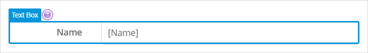

## 1 Introduction

Input widgets show data to the user and, optionally, allow them to edit the data.

Input widgets need to be linked to an attribute of an entity in order to function. As such, they must be placed within a data widget containing by an object of that entity type.

For example, the input widgets can be placed inside a [data view](data-view):

The Input widgets category contains the following widgets:

*   [**Text Box**](text-box) – displays and, optionally, allows the user to add or edit, text data from a *numeric* or *string-like* attribute:

    

*   [**Text Area**](text-area) – displays and, optionally, allows the user to add or edit, long text data from a *string* attribute:

    

*   [**Drop-Down**](drop_down) – shows the current value of and, optionally, allows users to pick an option from, a list of options in an *enumeration* attribute:

    

*   [**Check Box**](check-box) – shows the current value of and, optionally, allows users to set, a *Boolean* attribute to `true` or `false`:

    

*   [**Radio Buttons**](radio-buttons) – shows the current value of and, optionally, allows users to pick an option from, a list of options in an *enumeration* attribute or the value of a *Boolean* attribute:

    

*   [**Date Picker**](date-picker) – shows and, optionally, allows users to pick, a *DateAndTime* attribute from a calendar:

    

*   [**Reference Selector**](reference-selector) – shows and, optionally, can be used to select a *one-to-one* or single *one-to-many* association, selected from the value of a *string*, *numeric*, *enumeration*, or *Data and Time* attribute on the associated object:

    

*   [**Reference Set Selector**](reference-set-selector) –  shows and, optionally, allows the user to add and remove, associated objects linked via a *many-to-many* association:

    

*   [**Input Reference Set Selector**](input-reference-set-selector) – is used to display and edit many-to-many associations (for more information on associations and their properties, see [Associations](associations))

    

{}
For more information on associations and their properties, see [Associations](associations)
{}

## 2 Performing Basic Functions

{}

## 3 Read More

* [Page](page)
* [Pages](pages)

  