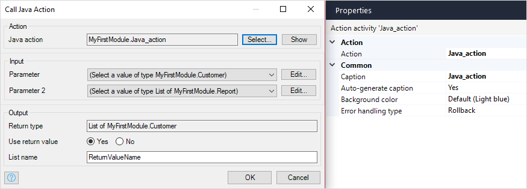

{}
This activity can only be used in **Microflows**.
{}

## 1 Introduction

The **Java action call** activity can be used to call a [Java action](java-actions). Arguments can be passed to the action and the result can be stored.

## 2 Properties

There are two sets of properties for this activity, those in the dialog box on the left, and those in the properties pane on the right:

The **Java action call** properties pane consists of the following sections:

* [Action](#action)
* [Common](#common)

## 3 Action Section {#action}

The **Action** section of the properties pane shows the action associated with this activity.

You can open a dialog box to configure this action by clicking the ellipsis (**…**) next to the action.

You can also open the dialog box by double-clicking the activity in the microflow or right-clicking the activity and selecting **Properties**.

### 3.1 Java Action

The Java action that is called by this activity.

### 3.2 Arguments

For each parameter of the Java action you have to supply an argument of the same type. The values of the arguments are expressed using [expressions](expressions).

### 3.3 Return Type

The return type is the [data type](data-types) of the result of the Java action. The return type is defined by the Java action.

### 3.4 Use Return Value

If **User return value** is set to *Yes* you will be asked to give the return value a name.

### 3.5 Variable Name, Object Name, or List Name

The result of the Java action will be given this name. The label indicates whether the result is a variable, object, or list. If it is an object or list, the **Return type** will indicate the entity which is being returned.

## 4 Common Section {#common}

{}