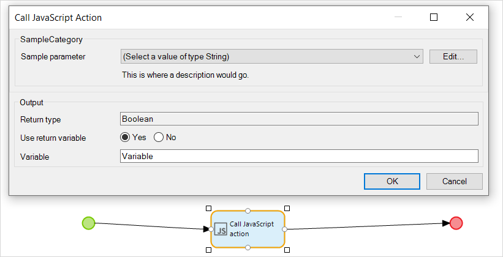

{}
This activity can only be used in **Nanoflows**.
{}

## 1 Introduction

The JavaScript action call activity can be used to call a [JavaScript action](javascript-actions). Arguments can be passed to the action, and the result can be stored.

## 2 Action Properties

Use action properties to integrate JavaScript actions into your nanoflows.

### 2.1 JavaScript Action

This property sets the JavaScript action called by an activity.

### 2.2 Arguments

An argument is the input data that you are passing to the JavaScript action. For each JavaScript action parameter, you must supply an argument of the same type. The values of the arguments are defined using [expressions](expressions):

## 3 Output Properties

Output properties allow you to customize the action result of your JavaScript action. When set up properly, output properties enable action results to be handled by your nanoflow.

### 3.1 Return Type

The return type property is the data type of the JavaScript action's result. The return type is defined by the JavaScript action.

### 3.2 Use Return Value

This property determines if the returned value from the JavaScript action should be stored in a variable.

### 3.3 Variable Name, Object Name, or List Name

The result of the Javascript action will be given this name. The label indicates whether the result is a variable, object, or list. If it is an object or list, the **Return type** will indicate the entity which is being returned. You may only set a variable name if **Use return value** has been set to **Yes**.

## 4 Read More

* [JavaScript Actions](javascript-actions)
* [Build JavaScript Actions](/howto/extensibility/build-javascript-actions)
* [Nanoflows](nanoflows)
* [Java Action Call](java-action-call)
