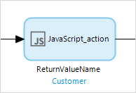
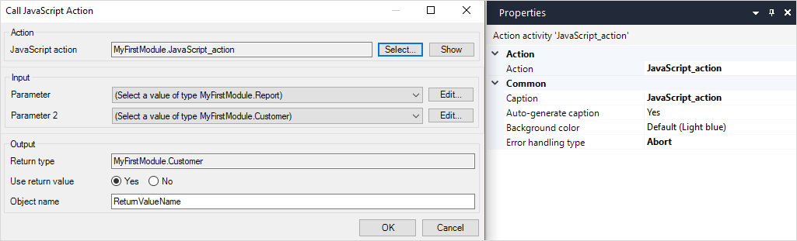

{}
This activity can only be used in **Nanoflows**.
{}

## 1 Introduction

The JavaScript action call activity can be used to call a [JavaScript action](javascript-actions). Arguments can be passed to the action, and the result can be stored.

## 2 Properties

There are two sets of properties for this activity, those in the dialog box on the left, and those in the properties pane on the right:

The **JavaScript action call** properties pane consists of the following sections:

* [Action](#action)
* [Common](#common)

## 3 Action Section {#action}

The **Action** section of the properties pane shows the action associated with this activity.

You can open a dialog box to configure this action by clicking the ellipsis (**…**) next to the action.

You can also open the dialog box by double-clicking the activity in the microflow or right-clicking the activity and selecting **Properties**.

### 3.1 JavaScript Action

This property sets the JavaScript action called by an activity.

### 3.2 Parameter

Depending on the selected JavaScript action, you will see a list of its parameters. Parameters pass data to the activity. 

#### 3.2.1 Arguments

Click **Edit** next to the parameter to fill in the arguments. 

An argument is the input data that you are passing to the JavaScript action. For each JavaScript action parameter, you must supply an argument of the same type. 

The values of the arguments are defined using [expressions](expressions):

### 3.3 Return Type {#return-type}

This read-only property indicates whether you will retrieve a variable, object or list. The return type is defined by the JavaScript action.

### 3.4 Use Return Value

This property determines if the returned value from the JavaScript action should be stored in a variable.

### 3.5 Variable Name, Object Name, or List Name

The name of the variable, list, or object returned by the activity. If it is an object or list, the [Return type](#return-type) will indicate the entity which is being returned. You may only set a variable name if **Use return value** has been set to **Yes**.

## 4 Common Section {#common}

{}

## 5 Read More

* [JavaScript Actions](javascript-actions)
* [Build JavaScript Actions](/howto/extensibility/build-javascript-actions)
* [Nanoflows](nanoflows)
* [Java Action Call](java-action-call)
