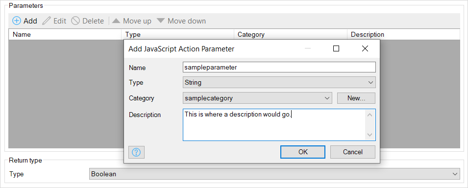
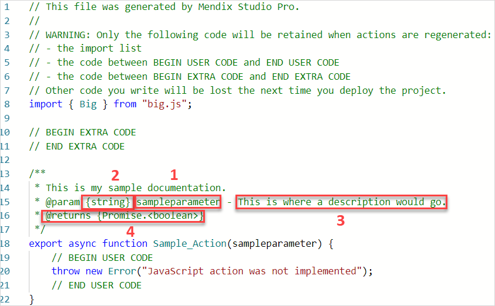
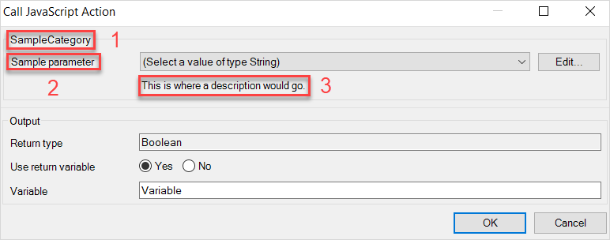
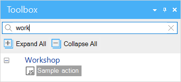
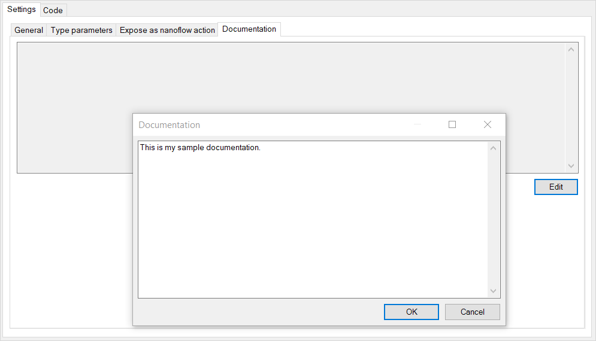
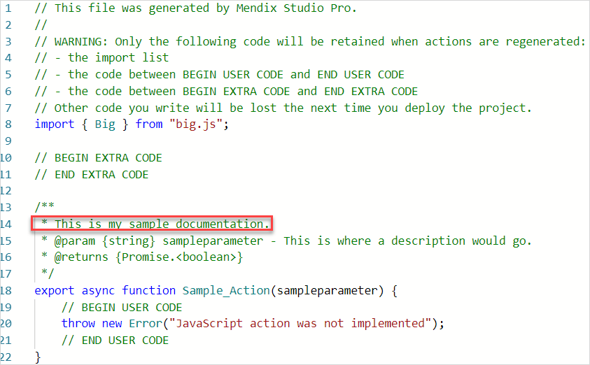

## 1 Introduction

With JavaScript actions, you can extend your application's functionality in ways nanoflows alone cannot. To use a JavaScript action, call it from a nanoflow using the [JavaScript Action Call](javascript-action-call).

{}

Each JavaScript action defined in Mendix Studio Pro corresponds to a file *{JavaScript action name}.js* in the subdirectory **javascriptsource{module name}/actions/** in your project directory.

The skeletons of these *.js* files are generated automatically when you save an action, and those JavaScript actions can immediately be edited in the embedded code editor.

{}

For a tutorial on creating, configuring, and using a JavaScript action, see this [Write JavaScript Actions](/howto/extensibility/write-javascript-actions) how-to.

## 2 General Settings

After double-clicking a JavaScript action in your **Project Explorer** you will see the JavaScript action's settings: 

{}{}

The settings for JavaScript actions and their implications are detailed below.

### 2.1 Name

This setting handles a JavaScript action's name, which a nanoflow refers to when performing a call to it. This name is also the name of the generated *.js* file.

### 2.2 Parameters

Parameters pass data to JavaScript actions. For example, if you had a JavaScript action which multiplied numbers, parameters would define the numbers to be multiplied. A JavaScript action can have zero or more parameters. Each parameter should have a unique name. You may add a parameter by clicking **Parameters** > **Add**, and then customize that parameter to pass data into a JavaScript action:

In a JavaScript action's **Code** tab, you can see its parameters' values and handle its implementation. Each parameter has a name (1), type (2), category, description (3), and return type (4):

You will see a parameter's category (1), parameter name (2), and description (3) in the **Call JavaScript Action** dialog window after double-clicking its activity in your nanoflow:

{}{}

The parameter types supported by JavaScript actions are described below.

#### 2.2.1 Name

This setting handles the parameter's name. A name is required. Names must start with a letter and contain only letters. Spaces are not permitted in names.

#### 2.2.2 Type

|   Name   |   Description   |
| ---- | ---- |
|  Object    |   The object parameter type allows you to pass a Mendix object to a JavaScript action. You must also select its entity type, which can be either a specific entity or a type parameter. In the generated JavaScript action template code, this type is represented as an MxObject. |
|   List   |   The list parameter type allows you to pass a list of Mendix objects to a JavaScript action. You must also select its entity type, which can be either a specific entity or a type parameter. In the generated JavaScript action template code, this type is represented as an array of MxObjects. |
|   Entity   |   The entity parameter type is a placeholder. It stands in for an entity that will be replaced with a new entity's name when it is called in a nanoflow. Additionally, the entity type can be used to fill in a type parameter. In the generated JavaScript action template code, this type is represented as a string.  |
|   Boolean   |   The Boolean parameter type allows you to pass a Boolean value to a JavaScript action.  |
|   Date and Time   |  The date and time parameter type allows you to pass a date and time value to a JavaScript action. In the generated JavaScript action code, this type will be represented as a JavaScript `Date`.  |
|   Decimal   |  The decimal parameter type allows you to pass a decimal value to a JavaScript action. In the generated JavaScript action code, this type will be represented as a [Big](https://www.npmjs.com/package/big-js) object.  |
|   Enumeration   |  The enumeration parameter type allows you to pass a enumeration value to a JavaScript action. In the generated JavaScript action code, this type will be represented as a string.  |
|   Integer/Long   |  The integer/long parameter type allows you to pass a decimal value to a JavaScript action. In the generated JavaScript action code, this type will be represented as a [Big](https://www.npmjs.com/package/big-js) object.  |
|   String   |  The string parameter type allows you to pass a string value to a JavaScript action. |
|   Return   |   The return parameter type determines the type of data a JavaScript action returns. Because many APIs are asynchronous, you can also return a `Promise` object which resolves to this type. The return value of the JavaScript action can be stored as a variable. This variable can be used in the nanoflow where it is called. In any type you can use for parameters, you can also use a return type.   |

#### 2.2.3 Category

Use categories to keep parameters apart in a [JavaScript Action Call](javascript-action-call). Categories are useful for making logical groups of parameters when your project has several parameters. If you do not specify a category, the parameter will appear in the **Input** group.

#### 2.2.4 Description

For projects with several parameters, descriptions serve as useful reminders of parameters' exact purposes. Descriptions also allow you to describe your parameters to project collaborators. Descriptions may contain both upper- and lower-case letters, numbers, and symbols.

## 3 Type Parameter Settings

A type parameter is a placeholder for an entity type which will be filled with a specific entity when called in a nanoflow. Type parameters can be used when configuring the data type of a parameter, which allows users to pass an object or list of an arbitrary entity type. They can easily be added, edited, or deleted:

{}{}

A JavaScript action can have zero or more type parameters. Each type parameter should have a unique name.

## 4 Expose as Nanoflow Action Settings

In the **Expose as nanoflow action** tab, it is possible to expose a JavaScript action as a nanoflow action. This sample action has been given *Sample Action* caption text, assigned *Workshop* as its category, and given no icon:

{}{}

Exposing the JavaScript action will make it appear in the **Toolbox** window when editing a nanoflow in the category of your choice. When this action is used in a nanoflow, it will show the caption and icon you provided. The category and caption are apparent here, and the default icon is being displayed as no custom one was assigned: 

### 4.1 Caption

A caption is required when exposing a JavaScript action. This caption will accompany your JavaScript action inside the nanoflow **Toolbox** window and can give helpful reminder information about your JavaScript action there.

### 4.2 Category

A category is required when exposing a JavaScript action. Use categories to organize JavaScript actions with similar purposes together in the nanoflow **Toolbox** window.

### 4.3 Icon

An icon is optional when exposing a JavaScript action. When no icon is selected, the default JavaScript action icon is used. The recommended size for an icon is 16x16 pixels.

## 5 Documentation Settings

In the **Documentation** tab, press **Edit** to document a JavaScript action: 

{}{}

Documentation is visible in the **Code** tab. Your documentation also is copied into the JavaScript action as comment on the function in the corresponding *.js* file:

{}{}

## 6 Code Settings

In the **Code** tab, you can edit the JavaScript action code without leaving Studio Pro. The editor is based on the [Monaco Editor](https://microsoft.github.io/monaco-editor/index.html). It offers features such as syntax highlighting and code completion.

## 7 Read More

* [JavaScript Action Call](javascript-action-call)
* [Nanoflows](nanoflows)
* [Write JavaScript Actions](/howto/extensibility/write-javascript-actions)
* [Java Action Call](java-action-call)
* [Microflow Call](microflow-call)