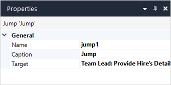

## 1 Introduction

The **Jump** activity allows you to jump to other activities in the workflow. This is useful when, for example, you are approving a request and need more details that are provided in one of the previous user tasks:

## 2 Properties

An example of Jump activity properties is represented in the image below:

The Jump activity properties consist of the **General** section.

### 2.1 Name

**Name** is the internal name of the element. When referring to the element in the app project you will use this name. It must be unique within the module, but you can have two elements with the same name in different modules. When referring to the element, you will normally prepend the name of the module to ensure uniqueness. 

### 2.2 Caption

The **Caption** describes what happens in this element. It is displayed in the workflow element to make the workflow easier to read and understand without needing to add annotations.

### 2.3 Target

**Target** is the activity the **Jump** goes to. You can select the activity you would like to go to from the drop-down menu. 

{}
You cannot use the **Jump** activity in a Parallel split or in a path where it would end the workflow without any other path continuing it. 
{}

## 3 Read More

* [Workflow Properties](workflow-properties)