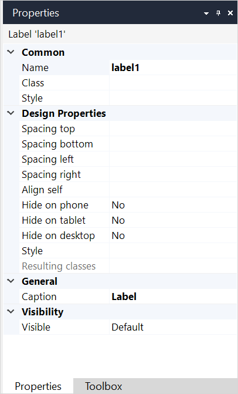

## 1 Introduction

{}The label widget is not supported on native mobile pages.{}

{}

For input widgets, it is recommended to use the [label property](text-box) to describe the purpose of widgets to end-users.

You can also use the [text widget](text) as it provides more features, e.g. you can add parameters, and it generates semantically correct HTML.

{}

A label shows static text, which describes the purpose of a specific widget to a user.

## 2 Properties

An example of label properties is represented in the image below:

{}
{}

Label properties consist of the following sections:

* [Common](#common)
* Design Properties
* [General](#general)
* [Visibility](#visibility)

### 2.1 Common Section {#common}

{}

### 2.2 General Section {#general}

The **General** section contains the **Caption** property. **Caption** defines the text that will be shown to a user.

### 2.3 Visibility Section {#visibility}

{}

## 3 Read More

* [Page](page)
* [Common Widgets](common-widgets)
* [Properties Common in the Page Editor](common-widget-properties)