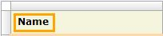

{}

For input widgets it is recommended to use the more powerful [label property](text-box) to describe their purpose.

For all other text use the [text widget](text) as it provides more features, e.g. text templates, and generates semantically correct HTML.

{}

A label shows static text, which intent is to describe the purpose of a specific widget to the user.

{}

A label placed in a cell with render mode header.

{}

## General properties

{}

## Visibility properties

{}

{}

## Common properties

{}

{}

{}
