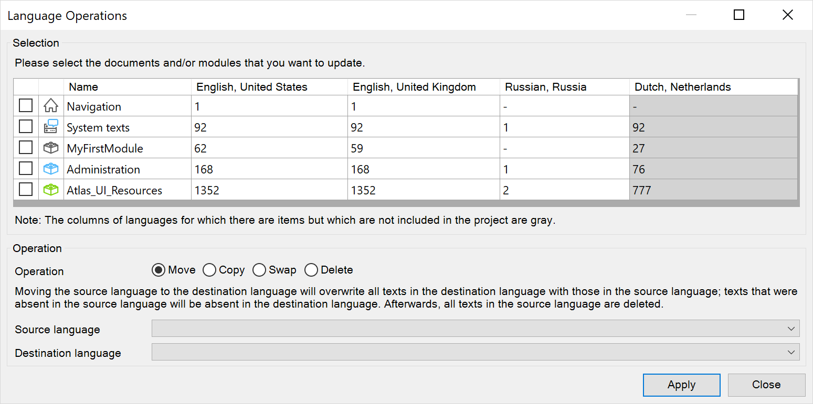

## 1 Introduction

### 3.1 Configuring Language Operations {#toconfigurelanguageoperations}

To update the language settings in Studio Pro, go to **Language > Language Operations**.

In the **Selection** section of the dialog box, you can select the documents and modules that you want to update. The columns of languages for which there are items but which are not included in the app project are gray.

In the **Operation** section of the dialog box, there are four language operation options, which are described below.

* **Move** – moves the source language to the destination language, which ovewrites all the texts in the destination language with those in the source language
	* Select the **Source language** and the **Destination language** in their respective drop-down menus for the move language operation
	* Texts that are absent in the source language will be absent in the desination language
	* Following this operation, all the texts in the source language will be deleted
* **Copy** – copies the source language to the destination language, which ovewrites all the texts in the desination language with those in the source language
	* Select the **Source language** and the **Destination language** in their respective drop-down menus for the copy language operation
	* Texts that were absent in the source language will be absent in the desination language
* **Swap** – swaps the source lanauge and the destination language, which moves all the texts in the source lanauge to the destination language and vice versa
	* Select the **First language** and the **Second language** in their respective drop-down menus for the swap language operation
* **Delete** – deletes all the texts in the language selected in the **Language** drop-down menu

Click **Apply** to apply the selected language operation.
