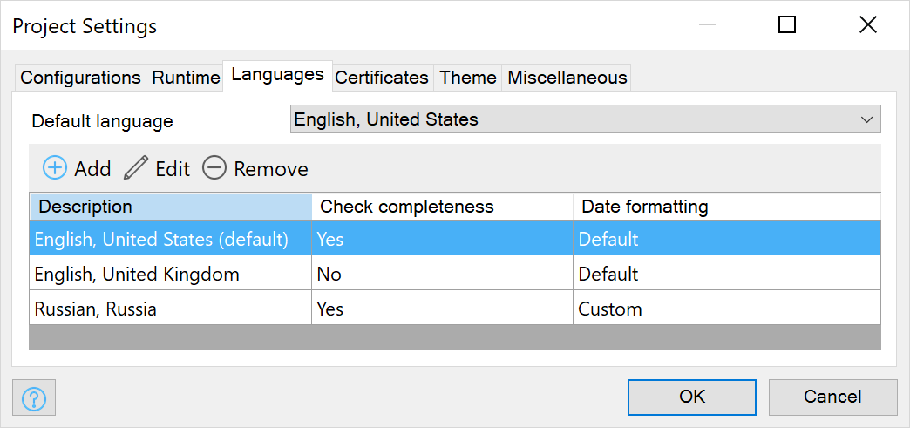
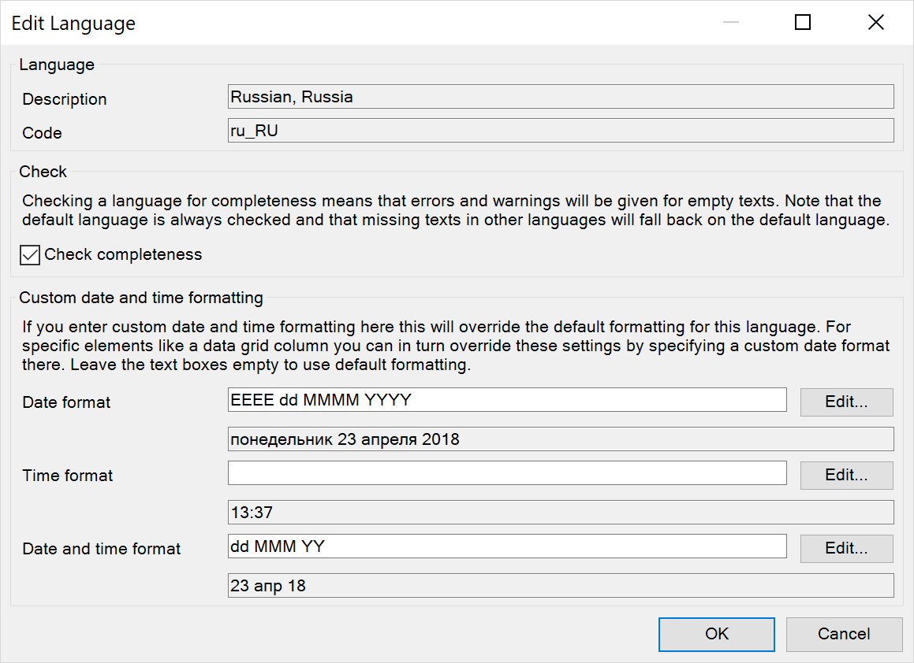
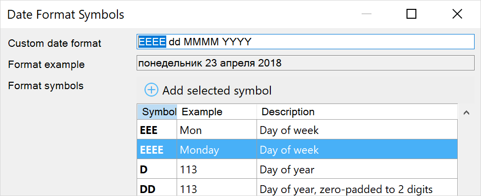

## 1 Introduction

Mendix is designed to be used by users in multiple languages. The **Languages** tab of the **Project Settings** allows you to select which languages your app will support.

You can reach this tab in two ways:

1. Select the menu option **Language > Language Settings…**.
2. Open the **Project '…' > Settings** dialog box from the [Project Explorer](project-explorer) and select the **Language** tab.

## 2 Setting Default Language

There must be a default app project language. Select the **Default language** from the drop-down list. This will contain all languages which have been added to your app. It is recommended that you do this when you start developing your app.

Setting the default language has two functions:

* it sets the language which will be displayed to the end-user if the end-user is not associated with a Language entity, or if the end-user's language is not enabled in the app
* it sets the language which will be used if there is no translation of a translatable text in the end-user's language, even if the app has the language enabled

The initial default language is *English, United States*.

## 3 Adding App Project Languages

You can add as many languages as you like from the list of supported languages by clicking **Add**, selecting the desired language, and clicking **OK**.

Most languages will be added with an empty dictionary, although some translations have already been set up in the Dutch dictionary.

## 4 Advanced Language Settings

You can set each language in your app to have additional settings.

### 4.1 Check Completeness

If you check the **Check completeness** box, you will get a warning (or error) message in the [errors pane](errors-pane) for every text which has no entry in this language's dictionary.

If this is the default language, the **Check completeness** box will be checked and you will not be able to uncheck it.

### 4.2 Custom Date and Time Formatting

You can set a custom format for the following:

* **Date format**
* **Time format**
* **Date and time format**

Type a format string in the relevant box and you will see an example of how a date will be formatted underneath.

Click **Edit…** to open a dialog box which will provide a full reference for the format string.

