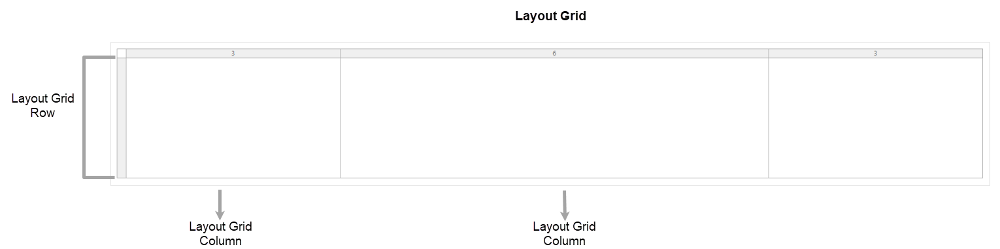
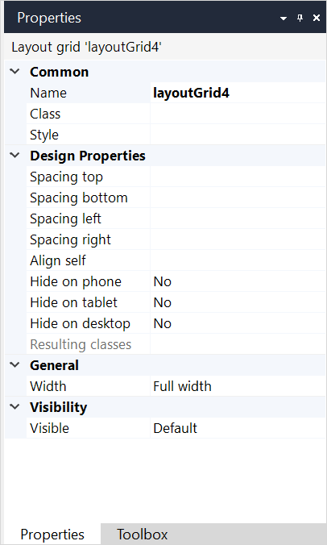
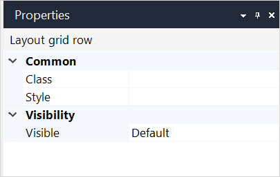
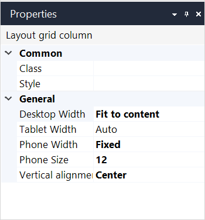
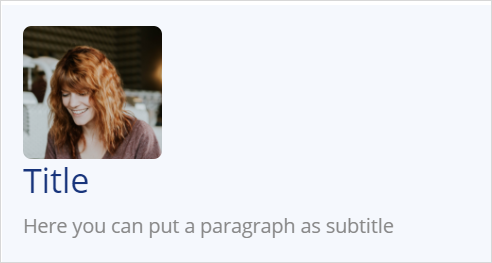
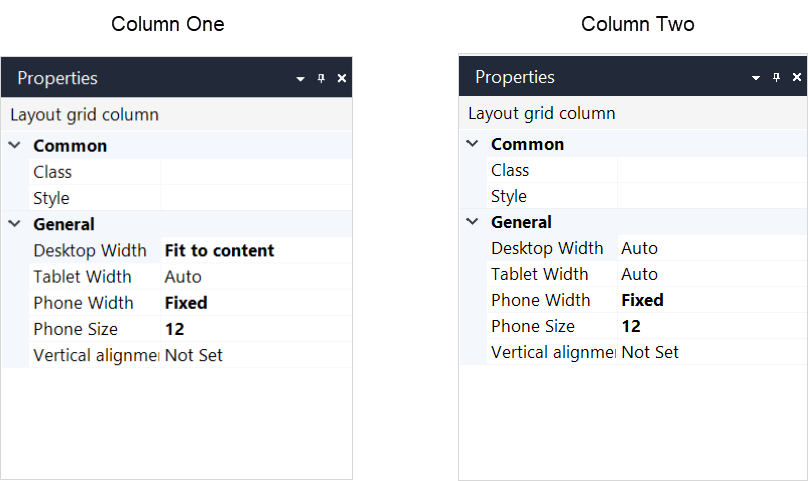
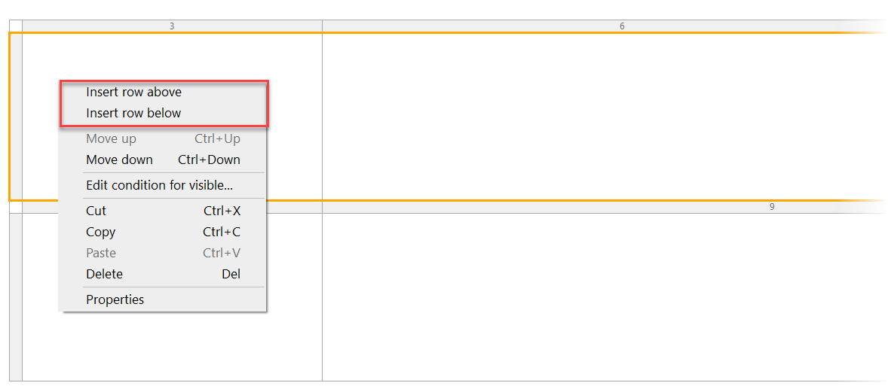

## 1 Introduction

The layout grid is a widget that gives structure to your pages.  

A layout grid consists of [rows](#rows) and [columns](#columns): 

In a browser, the layout grid is based on the Bootstrap grid system. For more information on the Bootstrap grid system, see the [official Bootstrap documentation](http://getbootstrap.com/css/#grid).

{}

Row and column properties described below are available if your project has [Mendix version 8.5.1](/releasenotes/studio-pro/8.5) or above  and [Atlas UI Resources](https://appstore.home.mendix.com/link/app/104730/) version 2.4.0 or above. 

For more information on row and column properties, see the [Rows and Their Properties](#rows) and [Columns and Their Properties](#columns) sections. 

{}

## 2 Layout Grid Properties

An example of layout grid properties is represented in the image below:

{}
{}

Layout grid properties consist of the following sections:

* [Common](#common)
* [Design Properties](#design-properties)
* [General](#general)
* [Visibility](#visibility)

### 2.1 Common Section {#common}

{}

### 2.2 Design Properties Section{#design-properties}

{}

### 2.3 General Section {#general}

#### 2.3.1 Width

The **General** section contains the **Width** property, which determines the width of the layout grid. 

| Value       | Description                                                  |
| ----------- | ------------------------------------------------------------ |
| Full width  | The layout grid spans the full width of the available space and will stretch and shrink. |
| Fixed width | The layout grid has a fixed width but it is still responsive to viewport changes. Note that the width is not configurable in Studio Pro but is determined by Bootstrap. |

{}

As the layout grid responds to the viewport width, and not to the width of its container, a fixed width layout grid should only be used on top-level.

{}

### 2.4 Visibility Section {#visibility}

{}

## 3 Rows and Their Properties {#rows}

A layout grid can contain one or more rows. Each row contains [columns](#columns) and the number of columns can differ per row.

An example of layout grid row properties is represented in the image below:

{}
{}

Row properties consist of the following sections:

* [Common](#row-common)
* [General](#row-general)
* [Visibility](#row-visibility)

### 3.1 Common Section {#row-common}

{}

### 3.2 General Section {#row-general}

The **General** section of a row contains the following properties:

* **Columns** – sets the number of columns in the row

* **Align columns vertically** – this property aligns all columns in a row vertically. You can select the following options:

  * **Not set** – alignment is not set

  * **Top** – columns are aligned to the top of the layout grid

  * **Center** – columns are aligned to the center of the layout grid

  * **Bottom** – columns are aligned to the bottom of the layout grid

{}This setting can be overridden by the **Align vertically** setting of an individual column.
{}

* **Spacing between columns** – when set to *Yes*, adds spacing between columns

### 3.3 Visibility Section {#row-visibility}

{}

## 4 Columns and Their Properties {#columns}

Columns form a row of a layout grid.  

 An example of layout grid column properties is represented in the image below:

Layout grid column properties consist of the following sections:

* [Common](#column-common)
* [General](#column-general)

### 4.1 Common Section {#column-common}

{}

### 4.2 General Section {#column-general}

#### 4.2.1 **Width** {#column-width}

This property allows you to define the column width. 

For *web* pages, it is divided into **Desktop Width**, **Tablet Width**,and **Phone Width** which allows you to define column width per device type.

For *native* pages, you will see one property called **Width**.

The **Width** property contains the following options:

* **Auto-fill** – takes the available space for a column (for example, if there is one column, it will span the column for the whole row, and for two columns, it will divide the space equally between them)
* **Auto-fit content** – automatically fits the size of the column to its content
* **Manual** – allows you to manually set the size of the columns

Column width can be used to make your layout more flexible and adaptive to different types of devices.

For example, you have a layout grid with one row and two columns: a picture is in one column, and a text with details is in another.

For the *desktop* and *tablet*, you might want to set the first column with a picture to **Auto-fit content** and and the second one to **Auto-fill**, this way the first column will adjust to the size of the picture, while the second one will take the rest of the row:

For *phone*, it can be a good idea to place two columns one under another, setting them to **Manual** width of *12* (for more information on the column size property, see the [Size](#column-size) section). In this case, the second column will be automatically wrapped to another line:

 

On the picture below you can see the settings for two column described above:

#### 4.2.2 **Size** {#column-size}

The **Size** option is displayed only if the [width](#column-width) is set to **Manual**. 

This setting allows you to manually set the column size for desktop, tablet, or phone by using the corresponding property: **Desktop Size**, **Tablet Size**, **Phone Size**. 

#### 4.2.3 Align Vertically

The **Align vertically** property overrides the **Align columns vertically** property on the row and sets alignment for an individual column.  

## 5 Performing Basic Actions

### 5.1 Adding a New Row or a Column

To add a new row, do the following:

1. Select an existing row in a layout grid.

2. Right-click and select **Insert row above** or **Insert row below**:

   

3. Select a column layout (how many columns should be in a row and what weight columns should have).

A new row is added to the layout grid.

To add a new column, do the following:

1. Select a column next to which you want to add a new one.
2. Right-click and select **Add column left** or **Add column right**.

A new column is added, the weight 1 is automatically set for it. 

### 5.2 Performing Other Actions on Rows

In adding to inserting a new row, you can perform the following actions when right-clicking a row:

* **Move up** – moves a row up in the layout grid, you can use a shortcut for it  <kbd>Ctrl</kbd> + <kbd>↑</kbd> 
* **Move down** – moves a row down in the layout grid, you can use a shortcut for it  <kbd>Ctrl</kbd> + <kbd>↓</kbd> 

### 5.3 Performing Other Actions on Columns

In adding to inserting a new column, you can perform the following actions when right-clicking a column:

* **Move left** – moves a column left in the row, you can use a shortcut for it  <kbd>Ctrl</kbd> + <kbd>←</kbd> 
* **Move right** – moves a column right in the row, you can use a shortcut for it  <kbd>Ctrl</kbd> + <kbd>→</kbd> 
* **Row** – allows you to perform actions on the column's row 

## 6 Read More

* [Page](page)
* [Container Widgets](container-widgets)
* [Properties Common for Widgets](common-widget-properties)
