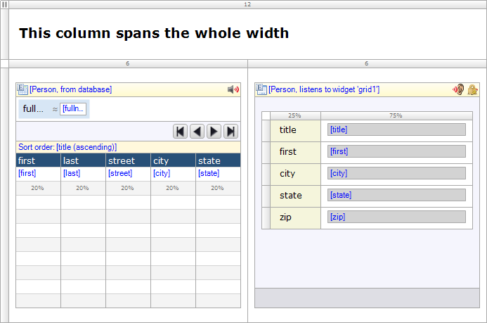

The layout grid is a widget that gives structure to your pages. A layout grid contains one or more rows and each row contains one to twelve columns. Each column has a weight, a number from 1 to 12, and the weights of the columns in a row must add up to 12\. In the browser the layout grid is implemented by the Bootstrap grid system. Reading the official Bootstrap [documentation on the grid system](http://getbootstrap.com/css/#grid) can help you understand what you can build with this widget.

## 

## Automatic classes

The layout grid is exported as nested div elements. In addition to the classes you specify in the various Class properties, a number of classes are added automatically.

```
<div class="container-fluid">
  <div class="row">
    <div class="col-md-6"> ... </div>
    <div class="col-md-6"> ... </div>
  </div>
  ...
</div> 
```

The outermost `div` represents the widget as a whole and gets the one of the following classes:

*   `container-fluid` when width is set to full width
*   `container` when width is set to fixed width

The second `div` represents a row and automatically gets the `row` class. The innermost `div` represents a column and automatically gets the weight class `col-md-<weight>`.

## Components

### Rows

A layout grid contains one or more rows. Each row can be styled with the Class and Style properties. Rows can be made conditionally visible through the property called 'Visible'.

Each row in turn contains columns and the number of columns can differ per row.

### Columns

A row in a layout grid contains one or more columns. Each column can be styled with the Class and Style properties. Additionally, the Weight property determines how wide the column is. The weights of all columns in a row must add up to 12\. Examples of valid rows are:

*   one column with weight 12
*   two columns, both with weight 6
*   a column with weight 3 and a column with weight 9. 

There is rarely a use case for more than four columns in a row.

## Common Properties

{}

{} 

{}

## General Properties

### Width

This property determines the width of the layout grid. 

| Value | Description |
| --- | --- |
| Full width | The layout grid spans the full width of the available space and will stretch and shrink. |
| Fixed width | The layout grid has a fixed width but it is still responsive to viewport changes. Note that the width is not configurable in the modeler but is determined by Bootstrap. |

{}

As the layout grid responds to the viewport width, and not to the width of its container, a fixed width layout grid should only be used on top-level.

{}

## Visibility Properties

{}
