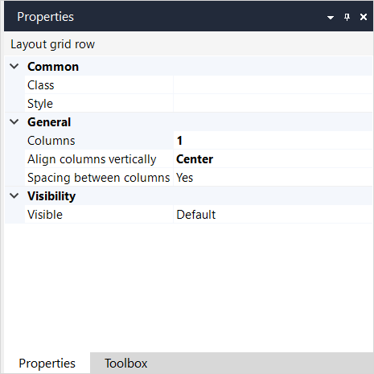

{}The layout grid widget is not supported on native mobile pages.{}

## 1 Introduction

The layout grid is a widget that gives structure to your pages. 

A layout grid contains one or more rows and each row contains one to twelve columns. Each column has a weight (a number from 1 to 12), and the weight of columns in a row must add up to 12. 

In a browser, the layout grid is based on the Bootstrap grid system. For more information on the Bootstrap grid system, see the [official Bootstrap documentation](http://getbootstrap.com/css/#grid).

## 2 Components

### 2.1 Rows

A layout grid can contain one or more rows. Each row contains [columns](#columns) and the number of columns can differ per row.

A row has the following properties:

* Class

* Style

*  Visible

    

For more information on properties listed above, see [Properties Common for Widgets](common-widget-properties).

### 2.2 Columns {#columns}

A row in a layout grid can contain one or more columns.

A column has the following properties:

* **Class** – allows you to specify one or more cascading style sheet (CSS) classes (for more information on properties listed above, see [Properties Common for Widgets](common-widget-properties)).
* Style
* Weight 

 Each column can be styled with the Class and Style properties. Additionally, the Weight property determines how wide the column is. The weights of all columns in a row must add up to 12\. Examples of valid rows are:

*   one column with weight 12
*   two columns, both with weight 6
*   a column with weight 3 and a column with weight 9. 

There is rarely a use case for more than four columns in a row.

## 3 Properties

### 3.1 Common Section

### 3.2 General Section

### Width

This property determines the width of the layout grid. 

| Value | Description |
| --- | --- |
| Full width | The layout grid spans the full width of the available space and will stretch and shrink. |
| Fixed width | The layout grid has a fixed width but it is still responsive to viewport changes. Note that the width is not configurable in Studio Pro but is determined by Bootstrap. |

{}

As the layout grid responds to the viewport width, and not to the width of its container, a fixed width layout grid should only be used on top-level.

{}

### 3.3 Visibility Section

## Read More

