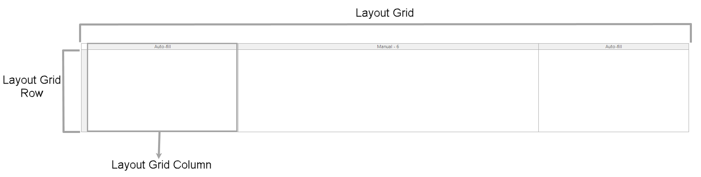

{}The layout grid widget is not supported on native mobile pages.{}

## 1 Introduction

The layout grid is a widget that gives structure to your pages.  A layout grid contains rows and columns: 

In a browser, the layout grid is based on the Bootstrap grid system. For more information on the Bootstrap grid system, see the [official Bootstrap documentation](http://getbootstrap.com/css/#grid).

## 2 Components

### 2.1 Rows

A layout grid can contain one or more rows. Each row contains [columns](#columns) and the number of columns can differ per row.

A row has the following properties:

* **Class** – allows you to specify one or more cascading style sheet (CSS) classes

* **Style** – allows you to specify additional CSS styling

*  **Visible** – allows you to hide an element from a page

    

For more information on properties listed above, see [Properties Common for Widgets](common-widget-properties).

### 2.2 Columns {#columns}

A row in a layout grid can contain one or more columns.   

A column has the following properties:

* **Class** – allows you to specify one or more cascading style sheet (CSS) classes (for more information on this property, see [Properties Common for Widgets](common-widget-properties))
* **Style** – allows you to specify additional CSS styling (for more information on this property, see [Properties Common for Widgets](common-widget-properties))
* **Weight** – determines how wide the column is, weight of all columns in a row must add up to 12. Examples of rows with valid column width are the following ones:
  * One column with weight 12
  * Two columns with weight 6 each
  * One column with weight 3 and one column with weight 9
 
In this example, you can see one column with weight 12 (which takes up the full width) and two columns with weight 6 each:

Starting with Studio Pro version [8.3.0](/releasenotes/studio-pro/8.3#830), the **Weight** property has been replaced by the following three properties, which allow for the easier creation of responsive layout grids:

* **Desktop Size** – the size of the column for desktop devices
* **Tablet Size** – the size of the column for tablet devices
* **Phone Size** – the size of the column for phone devices

The desktop sizes of all columns in a row must add up to 12. This restriction does not apply to tablet or phone sizes, which enables wrapping columns on smaller devices. Here is an example configuration:

* 4 columns with size 3 on desktop
* 4 columns with size 6 on tablet (creating a 2x2 grid)
* 4 columns with size 12 on phone (showing all columns as a separate row)

#### 2.2.1 Adding a New Row or a Column

To add a new row, do the following:

1. Select an existing row in a layout grid.

2.  Right-click and select **Insert row above** or **Insert row below**:

    

3. Select a column layout (how many columns should be in a row and what weight columns should have).

A new row is added to the layout grid.

To add a new column, do the following:

1. Select a column next to which you want to add a new one.
2. Right-click and select **Add column left** or **Add column right**.

A new column is added, the weight 1 is automatically set for it. 

#### 2.2.2 Performing Other Actions on Rows

In adding to inserting a new row, you can perform the following actions when right-clicking a row:

* **Move up** – moves a row up in the layout grid, you can use a shortcut for it  <kbd>Ctrl</kbd> + <kbd>↑</kbd> 
* **Move down** – moves a row down in the layout grid, you can use a shortcut for it  <kbd>Ctrl</kbd> + <kbd>↓</kbd> 

#### 2.2.3 Performing Other Actions on Columns

In adding to inserting a new column, you can perform the following actions when right-clicking a column:

* **Move left** – moves a column left in the row, you can use a shortcut for it  <kbd>Ctrl</kbd> + <kbd>←</kbd> 
* **Move right** – moves a column right in the row, you can use a shortcut for it  <kbd>Ctrl</kbd> + <kbd>→</kbd> 
* **Row** – allows you to perform actions on the column's row 

## 3 Properties

An example of layout grid properties is represented in the image below:

{}
{}

Layout grid properties consist of the following sections:

* [Common](#common)
* Design Properties
* [General](#general)
* [Visibility](#visibility)

### 3.1 Common Section {#common}

{}

### 3.2 General Section {#general}

#### 3.2.1 Width

The **General** section contains the **Width** property, which determines the width of the layout grid. 

| Value | Description |
| --- | --- |
| Full width | The layout grid spans the full width of the available space and will stretch and shrink. |
| Fixed width | The layout grid has a fixed width but it is still responsive to viewport changes. Note that the width is not configurable in Studio Pro but is determined by Bootstrap. |

{}

As the layout grid responds to the viewport width, and not to the width of its container, a fixed width layout grid should only be used on top-level.

{}

### 3.3 Visibility Section {#visibility}

{}

## 4 Read More

* [Page](page)
* [Container Widgets](container-widgets)
* [Properties Common in the Page Editor](common-widget-properties)
