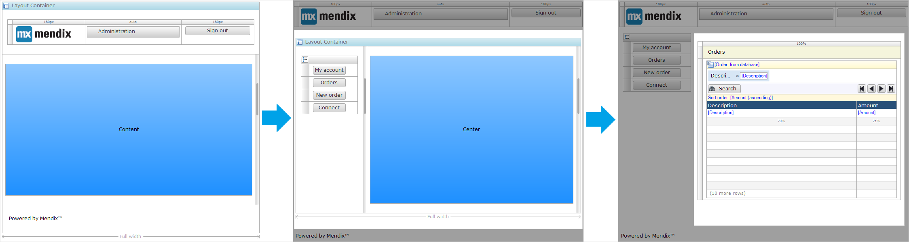
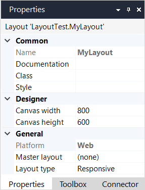
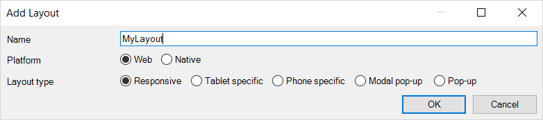

## 1 Introduction

Layouts specify what comes where. Each [page](page) is based on a layout. The layout contains widgets and structures that return on every page based on that layout. For example, it is common to put a menu bar widget in a layout so that the menu is visible on all pages.

A layout consists of content and [placeholders](placeholder). The content is everything that should be present in every page that uses the layout, from navigation bars to sign-out buttons. Placeholders are empty areas that later form the canvas for any pages that make use of the layout. The layout content remains the same in every page, but the placeholders cover what is unique to every individual page. 

Layouts can be based on other layouts, in which case the generic layout is referred to as the master layout. If a layout has a master layout, it can use the placeholders defined in the master to create a more specialized configuration. If a page is based on this specialized layout, it makes use of the placeholders defined in the new layout, ignoring those of the master layout. 

This chain can be as long as is necessary, with a generic layout used throughout the project  as a master layout for a more specific data input layout which is, in turn, used as a master layout for a specialized edit user layout. 

When opening a new page in the browser, the content found in the layouts is not reloaded if the layout is re-used by the new page. That is, if a user transitions from page A to page B, both of which use layout X, the placeholder content is refreshed, but the layout content is unaffected. This allows for navigation between pages without losing valuable input or performing a costly refresh on elements that do not require one. Example scenarios include a tab container that does not require the user to select the correct tab every time a new page is opened, or a sidebar menu with user input that should not be cleared after every single refresh. 

Mendix will intelligently detect if pages share a layout, so no user input is required. This also applies for nested layouts. If two pages have different layouts but those layouts share a common master layout, the sub-layout will reload, but the master layout will remain static.

## 2 Properties

An example of layout properties is represented in the image below:

{}
{}

Layout properties consist of the following sections:

* [Common](#common)
* [Designer](#designer)
* [General](#general)

### 2.1 Common Section{#common}

{}

### 2.2 Designer Section{#designer}

#### 2.2.1 Canvas Width

**Canvas width** defines the width in pixels of the page in the page editor. It is purely used for editing purposes; this property has no effect on the width of the page in the actual application.

Default value: *800*

#### 2.2.2 Canvas Height

**Canvas height** defines the preferred minimum height in pixels of the page in the page editor. It is purely used for editing purposes; this property has no effect on the height of the page in the actual application.

Default value: *600*

### 2.3 General Properties{#general}

#### 2.3.1 Platform

**Platform** can only be set when a layout is created.

The values for the platform property are:

* Web *(default)* – these layouts are used for pages which are going to be displayed in a browser or hybrid mobile app
* Native – these layouts are used for pages which are going to be displayed in a native mobile app

For existing layouts, the value is read-only.

#### 2.3.2 Master Layout

**Master layout** specifies a layout on which this layout is based. If no master layout is specified, the layout contains a single widget (for example, a [scroll container](scroll-container)) that defines the structure of pages based on this layout. If a master layout is specified, this layout fills the gaps defined by the master layout. You can introduce new gaps in this layout by using [placeholders](placeholder).

#### 2.3.3 Layout Type

The **layout type**, determines the purpose of the layout and how a page using the layout is opened.

##### Web layout types

| Layout Type | Description |
| --- | --- |
| **Responsive** | Pages that will work fine on all types of devices. |
| **Tablet specific** | Pages to be displayed on a tablet because the responsive option does not provide a good user interface on a tablet. |
| **Phone specific** | Pages to be displayed on a phone because the responsive option does not provide a good user interface on a phone. |
| **Modal pop-up** | Pages that appear as [modal pop-up windows](https://www.wikiwand.com/en/Modal_window). |
| **Pop-up** | Pages that appear as *modeless* pop-up windows. |

##### Native layout types

| Layout Type | Description |
| --- | --- |
| **Default** | Pages that can be used for all purposes. |
| **Pop-up** | Pages that slide in from the bottom and have a close icon instead of a back icon in the header. When a page with a default layout is open, all pop-up pages are dismissed and removed from the history. |

## 3 Layout Widgets

Layouts can contain the following widgets:

*   [Layout grid](layout-grid)
*   [Scroll container](scroll-container)
*   [Placeholder](placeholder)
*   [Header](header)
*   [Sidebar toggle](sidebar-toggle-button)

Placeholder, header, and sidebar toggle are unique to layouts, whilst Layout grids and scroll containers can also be used on pages.
