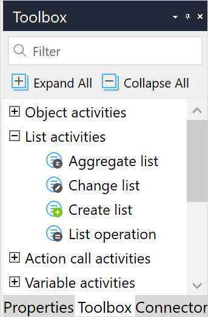

## 1 Introduction

When working with the Mendix Platform, you can use microflows to manipulate not only single objects but whole lists of entities with a single activity.

Additional activities which work on lists, [commit object(s)](committing-objects), [delete object(s)](deleting-objects), and [retrieve](retrieve), are in the [Object Activities](object-activities) section of the toolbox. You can also [loop](loop) through a list to perform activities on the individual objects.

The activities described in this document are in the **List Activities** section of the **Toolbox**:

{{% image_container width="40%" %}}

{}

The following are the list activities you can use in your microflow or nanoflow:

* [Aggregate List](aggregate-list) – calculates aggregated values over a list
* [Change List](change-list) – adds objects to, and removes objects from a list
* [Create List](create-list) – creates an empty list
* [List Operation](list-operation) – performs actions on a list and, if the result is a list, returns a new list containing the result

## 2 Read More

* [Activities](activities)
