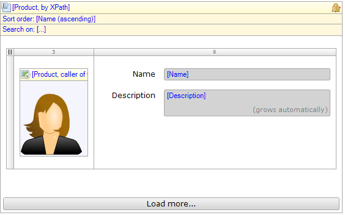

The list view is similar to the template grid. The list view shows a list of objects arranged vertically. Each object is shown using a template. During development, the object template is defined by placing a widget inside the list view's dropzone. The list of objects shown is determined by a datasource.

{}

A read-only list view showing all available products.

{}

## Common properties

{}

{}

{}

## General properties

### Editable

If this property is set to 'Yes', items in the list view can be edited. The changes made to list view items can be saved with a save button and reverted with a cancel button. Searching and paging are disabled to avoid confusion about what changes are saved or reverted.

### Click action

The click action defines what action is performed when a list view entry is 'clicked'. This can either be opening a page or calling a microflow. For opening a page see [Opening Pages](opening-pages) and for the microflow settings see [Starting Microflows](starting-microflows). The list view has no Confirmation or Advanced microflow settings.

### Page size

With this property you can change the number of containers that will be shown in one page. You cannot set this property when the list view is editable.

## Data source properties

The data source determines which objects will be shown in the list view. For general information about data sources, see [Data Sources](data-sources).

### Type

The list view supports the following types of data sources: database source, XPath source, association source and microflow Source. The database and XPath sources retrieve objects from the database and supports searching and sorting. The database source can also be used in [offline](offline) applications. The association source follows an association from the enclosing data view to get to the objects. Finally, the microflow source calculates the list of objects by executing a microflow.

### Other properties

See the corresponding data source for its properties:

*   [Database source](database-source)
*   [XPath source](xpath-source)
*   [Microflow source](microflow-source)
*   [Association source](association-source)

## Templates properties

### Templates

If the entity that is connected to the list view has specializations, you can optionally specify templates for each specialization. For each row in the list view the most specific template is shown. The different templates can be selected by clicking the extra header that appears when a specialization template is added.

{}

Let us say you have an entity Vehicle and two specializations thereof: Bicycle and Car. And there is a specialization of Car called SportsCar. You create a list view that is connected to Vehicle. With the templates property of the list view you specify what template to show for arbitrary Vehicles. For the specializations Bicycle and Car you create separate templates to show them.

Now if there is a row of type Bicycle the template specific for bicycles will be shown. A row of type Car will be shown in the template for Car. A row of type SportsCar is shown in the template for Car. There is no template specific for sports cars (in this example) and Car is the 'closest' generalization for which there is a template.

{}

## Visibility properties

{}

{}
