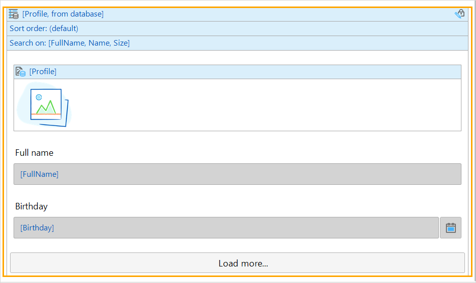
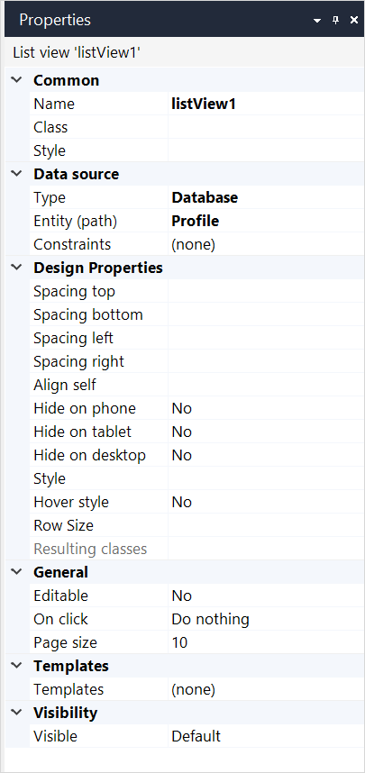

## 1 Introduction

A list view shows a list of objects. For example, you can display a list of all profiles:

 

Each object is shown using a template. This template is defined by placing widgets inside the list view's drop-zone. The list of objects shown is determined by a [data source](#data-source).

## 2 Properties

An example of list view properties is represented in the image below:

{}
{}

List view properties consist of the following sections:

* [Common](#common)
* [Data source](#data-source)
* Design Properties
* [General](#general)
* [Templates](#templates)
* [Visibility](#visibility)

### 2.1 Common Section {#common}

{}

### 2.2. Data Source Section {#data-source}

The data source determines which objects will be shown in a list view. For general information on data sources, see [Data Sources](data-sources).

#### 2.2.1 Type

The list view supports the following types of data sources: 

* [Database source](database-source) – objects are retrieved directly form the database. The database source can be used in [offline](offline-first) applications. 
* [XPath source](xpath-source) – objects are retrieved directly form the database
* [Microflow source](microflow-source) – calculates the list of objects by executing a microflow
* Nanoflow source – calculates the list of objects by executing a nanoflow
* [Association source](association-source) – follows an association to get to objects

The database and XPath sources retrieve objects from the database and supports searching and sorting. 

{}Searching is not supported on native mobile pages.{}

### 2.3 General Section {#general}

#### 2.3.1 Editable

If this property is set to *Yes*, items in the list view can be edited. The changes made to list view items can be saved with a **Save** button and reverted with a **Cancel** button. **On click** and **Page size** properties are not displayed to avoid confusion about what changes are saved or reverted.

#### 2.3.2 On Click 

An on-click event defines what action is performed when a user clicks a list view row. For more information on on-click events, see [On Click Event](on-click-event). 

#### 2.3.3 Page Size

the number of rows displayed on the page; after the indicated limit is reached, the **Load more...** button is displayed on the page.

#### 2.3.4 Scroll Direction

{}The scroll direction property is only supported on native mobile pages.{}

This property determines whether the list view lays out its items vertically (default) or horizontally.

#### 2.3.5 Number of Columns

{}The number of columns property is only supported on native mobile pages.{}

With this property you can change the number of items that will be shown next to each other in one row.
If you set the scroll direction property to horizontal, this property determines the number of items per column.

#### 2.3.6 Pull Down Action

{}The number of columns property is only supported on native mobile pages.{}

The pull down action defines what action is performed when you drag downwards on a list view.
Its common behavior is to update the contents of the list view by synchronizing data.

### 2.4 Templates Section {#templates}

{}Templates are not supported on native mobile pages.{}

If the entity that is connected to the list view has specializations, you can optionally specify templates for each specialization. For each row in the list view the most specific template is shown. The different templates can be selected by clicking the extra header that appears when a specialization template is added.

{}

Let us say you have an entity Vehicle and two specializations thereof: Bicycle and Car. And there is a specialization of Car called SportsCar. You create a list view that is connected to Vehicle. With the templates property of the list view you specify what template to show for arbitrary Vehicles. For the specializations Bicycle and Car you create separate templates to show them.

Now if there is a row of type Bicycle the template specific for bicycles will be shown. A row of type Car will be shown in the template for Car. A row of type SportsCar is shown in the template for Car. There is no template specific for sports cars (in this example) and Car is the 'closest' generalization for which there is a template.

{}

### 2.5 Visibility Section {#visibility}

{}

## 3 Read More

* [Page](page)
* [Data Widgets](data-widgets)
* [Data Sources](data-sources)
* [Properties Common for Widgets](common-widget-properties)