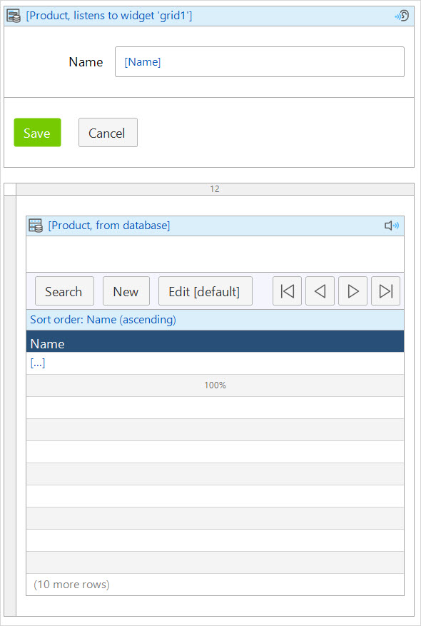

## 1 Introduction

The listen-to-widget data source is a data view specific source that allows a data view to display detailed information on an object selected in a data grid, template grid, or a list view on the same page. This is especially useful when displaying large amount of data, which limits the information available per object, as it allows the user to view details of an individual object without having to open a new page.

{}
{}

A data view in an image above listens to a data grid. In this example, the data view will display the name of the selected product if one is selected.

List views, template grids, and data grids are list widgets and can be listened to. If no object is selected in the list widget, the data view will remain empty and unresponsive.

## 2 Properties

### 2.1 List Widget

Specifies the list widget which controls the object shown in the data view.
