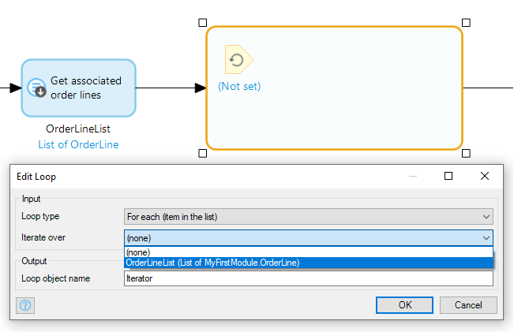
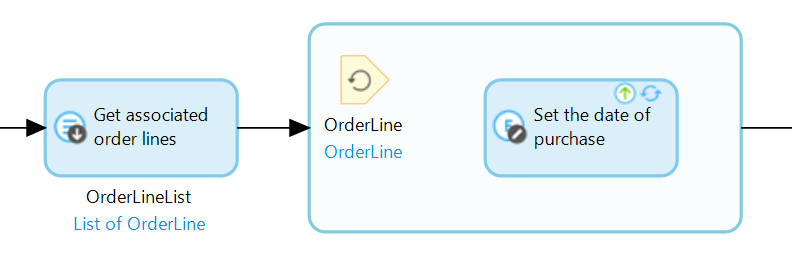
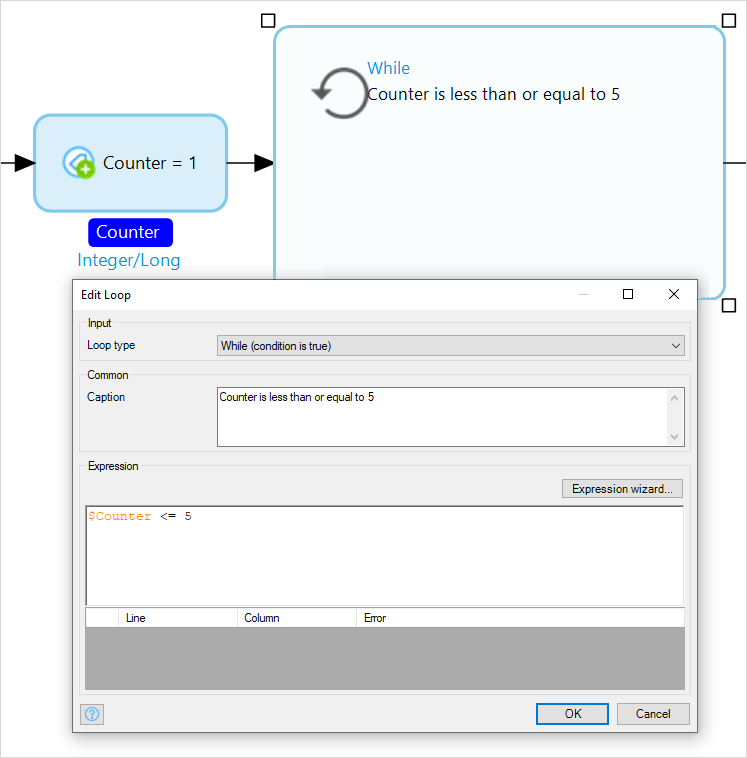

## 1 Introduction

A loop is used to execute repeated actions and is visualized as a frame. For each iteration the flow inside the loop is executed. The loop can be configured to iterate over a list or based on a boolean expression, check out [loop type section](#loop-type) for more details on each loop type.

The loop can contain all types of elements used in microflows, except for start and end events. Only a loop can contain [break events](break-event) and [continue events](continue-event).

## 2 Input Properties

### 2.1 Loop type{#loop-type}
* [For each (item in the list)](#for-each)
* [While (condition is true)](#while)

#### 2.1.1 For each (item in the list){#for-each}
This is the default type when creating a new loop activity and can be used to iterate over a list of objects. The list can be configured by setting *Iterate over* property to a list in your flow scope, and for each object in the list the flow inside the loop will be executed. The iterator, which looks the same as a parameter, represents the current object in the list for each iteration and it can be renamed by setting *Loop object name*. This object is shown in black and the entity type of the object is in blue.

For example, if you have a list of objects of the *OrderLine* entity and you want to set the purchase date for every object, you can use a loop with a change activity in it that sets the purchase date:

#### 2.1.2 While (condition is true){#while}

*While* loop repeats the flow inside the loop many times until some condition evaluates to `false`. This condition is evaluated before each execution of the loop body. Typically, the while loop is used when it is impossible to determine the exact number of loop iterations in advance.

You can provide a description for the loop or the condition by setting the *Caption* field, and the loop condition can be entered as an [expression](expressions) in the *Expression* editor, and should result in a boolean value. The *While* keyword is shown in blue and the *Caption* is shown underneath in black.

For example, if you want to [log](log-message) numbers between 1 and 5, you can use a loop with a condition that checks whether a *Counter* [variable](variable-activities) is less than or equal to 5, and inside the loop you log the *Counter* value and add 1 to *Counter* variable in order for the loop to stop executing when the *Counter* is greater than 5:

