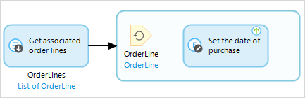

A loop is used to iterate over a list of objects. For each object the flow inside the loop is executed. The flow starts at the element that has no incoming sequence flows. A loop can contain all elements used in microflows, with the exception of start and stop events. Additionally, a loop (and only a loop) can contain [break events](break-event) and [continue events](continue-event).

The iterator which looks the same as an input object represents the variable that holds one element of the list for each iteration. Beneath it the name of the variable is shown in black and the type of the variable in blue.

{}

If you have a situation where you have a list of objects of the entity 'OrderLine' and you want to set the purchase date for every object, you can use a loop with a change activity in it that sets the purchase date.

{}

## Input Properties

### Iterate over

The list variable over which this loop will iterate.

## Action Properties

### Name

The name of the variable that will hold one element of the list at a time. The flow inside the loop is executed for each element in the list and each time this variable will contain the current element. If the list variable over which the loop iterates is of type `List of Order`, the iterator variable will be of type `Order`.
