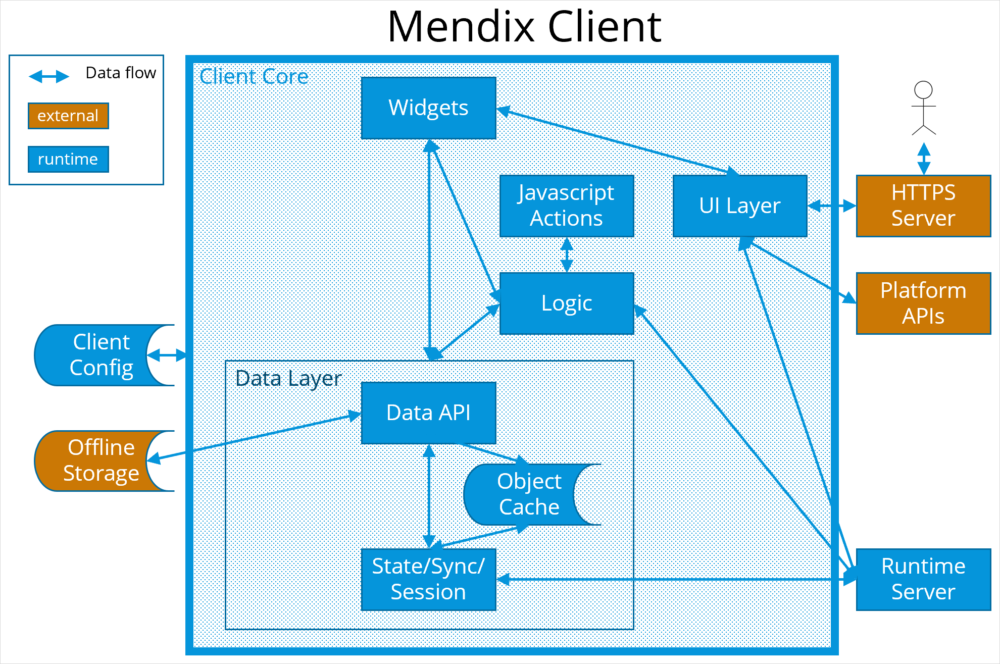

## 1 Introduction

The Mendix Client runs on the end-user's device and handles the interface between the end-user and the app. Sometimes it can run completely independently of the Runtime Server and perform all processing locally. Mostly, it interacts with the Runtime Server to get or update shared data, or perform additional application logic.

This description of the Mendix Client is based on using the Runtime Server of an app running in the cloud. You can also run Mendix locally for testing, but this is conceptually the same.

## 2 Description

The Mendix Client is a single page application controlled by the client core. This means that all paging is handled by the Mendix Client, rather than being separate pages served to the browser using different URLs. The initial page on which code is bootstrapped is called "shell", and the code consists of the *Core* and *Widgets*.

Because the Mendix Client can run in a browser, everything in the Mendix Client is visible to the end-user. Security is carried out in the Runtime Server, which will only send information to the Mendix Client which the user is allowed to see.

The shell page is created in different ways, depending on the sort of client.

* For a **browser** client, the initial page is provided by a *theme*
* For a ***mobile app*** the initial page is packaged as an android or iOS app to be downloaded to the mobile device

Below is a chart showing the components of the Mendix Client. Each of the components is described below the chart.

### 2.1 Client Core

This can be seen as the interpreter of the client. It uses the client config and client state to decide how to process a request from the end-user.
The client core controls the various processes which need to take place to service the request. These processes include data fetching and manipulation, client-side expressions, and navigation.

The client core is written in JavaScript.

Mendix apps do not modify the client core, all logic is held in the model. However, each patch version of Mendix comes with its own version of the client core.

### 2.2 Widgets

These are the fundamental building blocks of the Mendix Client. All the actions which the client takes are controlled by widgets. They are responsible for what is displayed on pages, and how user input is managed. There is a more detailed description of widgets in [Widgets](#widgets), below.

### 2.3 Javascript Actions

This runs custom JavaScript, added by the app developer, which is held as JavaScript actions in the client config.

### 2.4 UI Layer

The UI layer performs navigation, resource loading, and platform integration. accepts interactions from the end-user (for example, data input or button presses) and passes them to the client core. It is responsible for building the page which is presented to the end-user in response to the actions of the Mendix Client, using the correct language and other locale settings.

### 2.5 HTTPS Server

The HTTPS server serves pages, widgets, and javascript actions, held in the model, to the end-user of the app.

### 2.6 Logic

This runs client-side logic which is defined in the nanoflows in the model.

### 2.7 Platform APIs

These are functions of the device on which the Mendix Client is running. In most cases this will be a function of a mobile device such as the camera or GPS location, but it can also include making calls to Mendix Native APIs or browser functions such as accessing an image file.

### 2.8 Client Config

This is the static data which is needed by the Mendix Client. For a browser-based client, this data is held online, with the Runtime Server. For native apps, this is held locally in a native bundle.

These include the shell page needed to start the Mendix Client, Cascading Style Sheets (css files) which define the app’s theme, and JavaScript files which define client-side logic.

### 2.9 CodePush

This process allows the Mendix app to distribute updates to clients which are running React Native apps.

### 2.10 Online Data

This manages the objects which are maintained in the Mendix Client (non-persistable, new, and changed objects) and ensures that they are passed to the Runtime Server when they are needed as part of a request.

### 2.11 Object Cache

This holds objects which are being used by the Mendix Client in memory – for example a list of objects returned by the Runtime Server to be displayed on a page. State handling will perform garbage collection to ensure that memory is released when it is no longer needed.

### 2.12 Offline Storage

This is permanent storage, usually on a mobile device, where data can be stored for apps which are running in offline mode. It differs from the temporary object storage in that data here is not lost at the end of a session, but is kept until it can be synced to the Runtime Server.

### 2.13 State/Sync/Session

This manages requests to the Runtime Server. Note that some actions in the Mendix Client will not require access to the Runtime Server. For example, if the Object Manager already has access to the required data in the temporary object storage, or if the app is written as “offline first”.

For more information about the communication between the Mendix Client and the Runtime Server, see [SIG–Mendix Performance Subjects](sig-mendix-performance-subjects-explanation).

#### 2.13.1 State Handling

This holds the current state of the app and communicates it to the Runtime Server. As the state is held in the Mendix Client, the Runtime Server can be stateless. This ensures that it is easier to scale your app horizontally by adding more instances as any instance can handle any request.
The state includes the following

* which page is being displayed
* the state of objects which are maintained by the object manager:
    * newly created and not-yet-committed persistable objects
    * non-persistable objects
    * attribute and association changes made to the objects

To avoid performance issues, the Mendix Client does not send the entire state to the runtime. State handling decides which parts of the state should be sent by analyzing the model during the deployment of the applications.

For more detailed information about state, see this blog: [https://www.mendix.com/blog/the-art-of-state-part-1-introduction-to-the-client-state/](https://www.mendix.com/blog/the-art-of-state-part-1-introduction-to-the-client-state/). This also includes a worked example where you can see, and duplicate for yourself, how state is passed to the Runtime Server.

State handling is also responsible for garbage collection. If you want to know more about this aspect, see this blog: [https://www.mendix.com/blog/the-art-of-state-part-2-garbage-collection/](https://www.mendix.com/blog/the-art-of-state-part-2-garbage-collection/).

#### 2.13.2 Synchronization

Where an app is “Offline First”, data created and changed in the app is stored locally until it is synchronized with the Runtime Server. This job is carried out by the synchronization process. This synchronizes the offline storage and object cache with the Runtime Server. For more information on offline first apps and synchronization, see [Offline-First](offline-first).

#### 2.13.3 Session

This ensures that any session with the runtime is kept alive and restored if necessary. It also acts as the authentication for all communications with the runtime which require it.

### 2.14 Runtime Server

The Runtime Server waits for requests from the Mendix Client, processes the request, and returns the requested data, plus any additional state information where appropriate. This is done through a private API called *xas*.

It will also notify the Mendix Client when changes are made to the app, and allows developers to connect a debugger to the client to debug nanoflows.

For a description of the Runtime Server, see [Runtime Server](runtime-server).

## 3 Widgets{#widgets}

Mendix pages are constructed from individual widgets. There are two types of widget which each run on a separate widget framework. Each widget framework provides APIs and controls the lifecycle of the widget.
The two types of widget are:

* Pluggable widgets
* Custom widgets

These are described in the sections below.

### 3.1 Pluggable Widgets

Pluggable widgets are reusable UI components written in React or React Native. This is a more powerful language than Dojo, which is used for Custom widgets, and is the recommended way of writing widgets. Pluggable widgets run on the native core framework using the pluggable widgets API which enables different pluggable widgets to communicate. They have limited access to web core widgets, but full access to the native core.

Pluggable widgets have many advantages over Custom widgets. For example, you can use conditional visibility and editability, and can place a Pluggable widget inside another Pluggable widget.

For more information, see [Pluggable Widgets API](/apidocs-mxsdk/apidocs/pluggable-widgets).

### 3.2 Custom Widgets

Custom widgets are written using Dojo and run on the web core framework using a previous version of the client API. Custom widgets can have access to some of the web core widgets through the API. However, they cannot use pluggable widgets or native core widgets which means that they cannot be used in native apps, or in offline hybrid apps. Custom widgets should only be used if you cannot create the functionality in a Pluggable widget.

For more information on Custom widgets, see [Hot To Build Custom Widgets](/howto/extensibility/widget-development).

## 4 Mendix Client Startup

When an end-user wants to use a Mendix app, they need to start up the client on their device before they can connect to the Runtime Server. The way this works depends on the method used to run the client. This can be one of the following:

* Browser
* Native App

How the Mendix Client is launched is described in the sections below.

### 4.1 Launching Mendix Client in a Browser

#### 4.1.1 Launch Flow

When the end-user launches an app in the browser, it triggers the following flow.

1. The end-user enters the URL of the app in the browser.

2. The browser loads the HTML web page ("shell").

3. The web page loads and starts the Mendix Client, together with the core widgets.

4. The Mendix Client loads any custom widgets.

5. The Mendix Client contacts the Runtime Server and authenticates the end-user.

6. The Mendix Client gets any additional configuration required from the Runtime Server.

    *The Mendix Client is now ready to start interacting with the end-user and will repeat the following steps for as long as the end-user’s session continues.*

7. The Mendix Client loads the page definition.

8. The Mendix Client loads pluggable widgets used on the page.

9. The Mendix Client retrieves any data required from the Runtime Server.

10. The Mendix Client builds the page.

11. The Mendix Client displays the page to the end-user.

12. The Mendix Client processes input from the end-user and repeats the steps above to show the correct page.

#### 4.1.2 Location of Mendix Client Resources

When the app is deployed, the static resources are placed in a structure referred to as the CDN. This includes the following:

* index.html – the initial HTML page which is loaded when the end-user starts the Mendix Client — this contains the client configuration and other static non-Mendix content (for example if Google analytics is added to the app)
* mxui.js – the main Mendix Client code
* app styling/Atlas – the app-specific css styling and static visual elements which define how a page is displayed
* widgets – both custom and pluggable widgets which are used by this app
* page definitions – xml page definitions which tell the Mendix Client what the pages for this app look like

### 4.2 Launching Native Mendix Client

The flow when launching a native app is different from launching in a browser. More information is stored locally as part of the app, and a native app can even be designed to run “offline first”, which means that it can still be run without any connection to the Runtime Server.

The flow described here is for production apps. During development, the flow is not the same. This enables you to do faster deployments and online debugging.

1. The end-user opens the app on their device. This is a project specific shell app, which runs natively on iOS or Android. It is released to the app store appropriate for the device. If a new version of the app is downloaded to the device, the app will behave as if the end-user has opened it, even if it was already open on their device.

2. The shell app loads a native bundle. This is the equivalent of the Mendix Client resources used by the Mendix Client running in a browser. It contains, for example, the Mendix Client code and page definitions. However, it is held locally on the device rather than centrally with the Runtime Server.

3. The Mendix Client contacts the Runtime Server and authenticates the end-user.

4. The Mendix Client gets any additional configuration required from the Runtime Server.

5. The Mendix Client performs a synchronization with the Runtime Server.

6. The Mendix Client checks the resources stored in Visual Studio App Center for updates to the native bundle. This enables the app to keep up-to-date without needing to download new versions of the app from the app store.

    *The Mendix Client is now ready to start interacting with the end-user and will repeat the following steps for as long as the continues to run.*

7. The Mendix Client prepares a page using either offline or online data.

8. The Mendix Client presents the page to the end-user.

9. The Mendix Client reacts to the end-user input.
